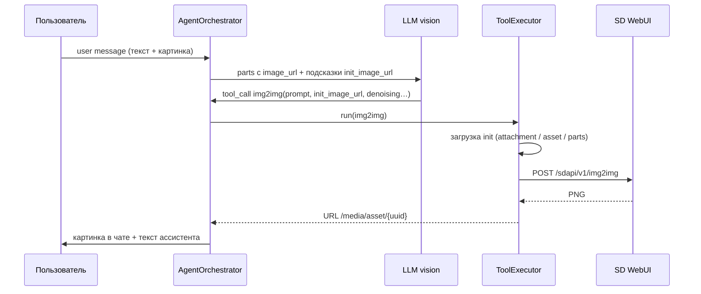

# FIX-IT: img2img при перегенерации не находит исходное изображение

> **Статус:** открыто (2026-05-16)  
> **Симптом в UI:** «Не удалось найти исходное изображение. Пришлите изображение ещё раз — прикрепите его как файл.»  
> **Связанные ID из воспроизведения:**  
> - беседа: `cfb3066b-1c9f-41e9-81b7-56a7d39b5c16`  
> - user-сообщение (перегенерация): `50fc2ac0-ca63-4fed-a7ef-68343d985a16`

---

## 1. Краткое описание

Пользователь в беседе с пресетом **img2img** прикрепляет картинку и просит перерисовку (или нажимает **перегенерировать** на своём сообщении). В интерфейсе картинка в пузыре user-сообщения **видна**, но агент не выполняет успешный `img2img` в Stable Diffusion: в логах нет `img2img SD завершён`, модель отвечает текстом с просьбой снова приложить файл.

Проблема **не в SD** (до WebUI запрос не доходит) и **не в WebSocket клиента** — сбой на этапе **разрешения init-изображения** для tool `img2img` и/или **передачи неверных аргументов от LLM**.

---

## 2. Ожидаемое поведение (целевой pipeline)

Документировано в `TODO.md` §9.5. Кратко:



**Критично:** пиксели в SD идут **с сервера** (файл/asset), не из «памяти» LLM. Vision нужен модели для промпта и `denoising_strength`.

---

## 3. Как проявляется (симптомы)

### 3.1. В чате (пользователь)

- В user-сообщении **отображается** превью изображения (`.message-images`).
- После «Перегенерировать» ассистент пишет варианты:
  - «Для перерисовки нужен attachment_id или корректный URL…»
  - «Не удалось найти исходное изображение. Пришлите изображение ещё раз…»
- Новой сгенерированной картинки под ответом **нет**.

### 3.2. В логах сервера (типичная картина)

Признаки **неуспешного** img2img:

| Признак | Значение |
|--------|----------|
| `tool_start: img2img` | есть |
| Время до следующего `POST …/chat/completions` | **~0.6–0.8 с** (слишком быстро для SD) |
| `img2img SD завершён` | **нет** |
| `img2img: init взят из user-сообщения` | **нет** (после патчей должен быть при успешном fallback) |
| `img2img ingest OK` | нет |
| Следующие tools | часто `get_gallery` (модель «ищет» картинку) |

### 3.3. Логи пользователя (2026-05-16, сессия 17:34–17:36)

**Клиент:**

```
[17:34:09.308] [INFO] [msg] Перегенерация user 50fc2ac0-ca63-4fed-a7ef-68343d985a16
[17:35:46.901] [INFO] [msg] Перегенерация user 50fc2ac0-ca63-4fed-a7ef-68343d985a16
```

**Сервер (фрагмент):**

```
2026-05-16 17:34:09,129 INFO [app.services.agent_orchestrator] БД: commit после delete_after, user 50fc2ac0-ca63-4fed-a7ef-68343d985a16 перед LLM/tools
2026-05-16 17:34:09,370 INFO [httpx] HTTP Request: POST http://192.168.88.41:8989/v1/chat/completions "HTTP/1.1 200 OK"
2026-05-16 17:34:51,017 INFO [app.services.streaming_draft] Черновик …: фаза tool (img2img)
2026-05-16 17:34:51,018 INFO [app.services.agent_orchestrator] tool_start: img2img
2026-05-16 17:34:51,018 INFO [app.integrations.tool_executor] Вызов инструмента img2img args=[...]
2026-05-16 17:34:51,018 INFO [app.services.agent_orchestrator] Раунд tools 1/10
2026-05-16 17:34:51,768 INFO [httpx] HTTP Request: POST …/chat/completions "HTTP/1.1 200 OK"
2026-05-16 17:34:55,140 INFO [app.services.agent_orchestrator] tool_start: get_gallery
…
2026-05-16 17:35:46,720 INFO [app.services.agent_orchestrator] БД: commit после delete_after, user 50fc2ac0-ca63-4fed-a7ef-68343d985a16 перед LLM/tools
2026-05-16 17:36:19,897 INFO [app.services.agent_orchestrator] tool_start: img2img
2026-05-16 17:36:19,897 INFO [app.integrations.tool_executor] Вызов инструмента img2img args=[...]
2026-05-16 17:36:19,898 INFO [app.services.agent_orchestrator] Раунд tools 1/10
2026-05-16 17:36:20,679 INFO [httpx] HTTP Request: POST …/chat/completions "HTTP/1.1 200 OK"
```

**Вывод из логов:** `img2img` вызывается, но **падает до SD**; модель уходит в `get_gallery` или снова в текст с ошибкой.

---

## 4. Архитектура и точки отказа

### 4.1. Цепочка при перегенерации

| Шаг | Компонент | Файл |
|-----|-----------|------|
| 1 | WS `regenerate` → фоновая задача | `app/api/websocket.py` → `_run_regenerate_task` |
| 2 | `run_regenerate_turn` | `app/services/agent_orchestrator.py` |
| 3 | `delete_after` ответов после user | `MessageRepository.delete_after` |
| 4 | Сбор `llm_messages`: system + history + **user parts из `content_json`** | `run_regenerate_turn` |
| 5 | Подсказки init для img2img | `append_img2img_init_hints` в `message_builder.py` |
| 6 | LLM → `tool_calls` | `llm_client.complete_with_stream` |
| 7 | `ToolExecutor.run("img2img", args)` | `tool_executor.py` → `_img2img` |
| 8 | Загрузка init | `_load_init_image` / `_resolve_user_message_init` |
| 9 | SD | `sd_tools.img2img` → `POST /sdapi/v1/img2img` |

### 4.2. Где хранится картинка user-сообщения

Теоретически **три** места (часто не все заполнены):

| Источник | Таблица/поле | Когда заполняется |
|----------|----------------|-------------------|
| A | `attachments` + `message_id` | При отправке сообщения: `link_to_message` после upload |
| B | `content_json.parts[]` с `type: image_url` и/или `asset_id` | `build_user_content` при создании сообщения |
| C | Только UI | Если сообщение старое/битое — в БД parts пустые, в UI URL из кэша |

**Гипотеза №1 (основная):** для сообщения `50fc2ac0-…` в БД **нет** привязанных `attachments` и/или **нет** `image_url` в `content_json.parts`, хотя UI показывает картинку (legacy, ручное редактирование, или asset удалён).

**Гипотеза №2:** LLM передаёт **неверный** `init_image_url` (галлюцинация, `/llm` URL, чужой host, `format: /media/asset/{uuid}/` как буквальный текст). Fallback не срабатывает, если в БД тоже пусто.

**Гипотеза №3:** на прод-сервере (`192.168.88.44:8090`) крутится **старая сборка** без патчей — в логах нет строк `img2img: init взят из user-сообщения`, добавленных в `tool_executor.py`.

**Гипотеза №4:** `MediaAsset` для `asset_id` из parts **удалён** cleanup-ом, файл на диске отсутствует — `_load_init_image` / `get_bytes` падает.

**Гипотеза №5:** `content_json` только текст (`content_text`), без `parts` — тогда vision при regenerate **не получает** картинку, hints пустые.

---

## 5. Текст ошибки: откуда берётся

| Текст | Источник |
|-------|----------|
| «Ошибка img2img: …» / «укажите init_image_url» | `ToolResult.content` из `tool_executor._img2img` |
| «Не удалось найти исходное изображение…» | **Ответ LLM** (следует системному промпту `IMG2IMG_PRESET_PROMPT` в `seed.py`: «если исходника нет — не вызывай инструменты; попроси прикрепить») |
| «attachment_id или корректный URL… format: /media/asset/{uuid}/» | Смесь промпта + интерпретация модели, не жёстко зашитый backend-текст |

То есть backend может вернуть tool error, а пользователь видит **перефразировку модели**.

---

## 6. Уже сделанные исправления (в репозитории `/root/web-chat`)

> Проверить, что **работающий** `web-chat.service` использует этот код (перезапуск после `git pull`, путь `WorkingDirectory`, venv).

### 6.1. Пресеты txt2img / img2img

- Раздельные пресеты `image_gen` и `img2img`, фильтр tools: `tools_for_preset_slug()` в `tool_definitions.py`.
- Документация: `TODO.md` §9.5.

### 6.2. UUID пресетов в SQLite

- Миграция: нормализация UUID **без дефисов** в `presets.id` (иначе PATCH preset → 404).
- `PresetRepository.get_by_id` — fallback по hex.
- Файлы: `app/db/migrate.py`, `app/db/repositories.py`.

### 6.3. Валидация width/height в img2img

- LLM иногда передавал `width` вне 512–2048 → `ValueError` до SD.
- `sanitize_llm_dimension`, валидация по **итоговым** `out_w/out_h`.
- Файлы: `img2img_service.py`, `sd_tools.py`.

### 6.4. Подсказки init для LLM

- `build_img2img_init_hint_text`, `append_img2img_init_hints`, `collect_img2img_init_lines`.
- Подсказки из **attachments** и из **`content_json.parts`** (если `message_id` в attachments пуст).
- Вызов при **новом** сообщении и при **regenerate** (пресет img2img).
- Файлы: `message_builder.py`, `agent_orchestrator.py`.

### 6.5. Fallback загрузки init на сервере

- `ToolExecutor._resolve_user_message_init()`:
  1. `AttachmentRepository.list_for_message(source_user_message_id)`
  2. `Message.content_json.parts` → `asset_id` / `image_url`
- `source_user_message_id` передаётся из `run_conversation_turn` и `run_regenerate_turn`.
- Файл: `tool_executor.py`.

### 6.6. Тесты

- `tests/test_img2img_service.py`, `tests/test_img2img_init_hints.py`, `tests/test_preset_tools.py`.
- На момент записи: **107 passed** локально (`pytest -q`).

---

## 7. Почему проблема может сохраняться после патчей

### 7.1. Нет подтверждения деплоя патчей

В логах **нет**:

```
INFO [app.integrations.tool_executor] img2img: init взят из user-сообщения …
```

Эта строка должна появляться при успешном fallback (уровень INFO). Её отсутствие при повторяющихся regenerate сильно указывает на:

- старый код на сервере, **или**
- `_resolve_user_message_init()` возвращает `None` (в БД реально нет источника init).

**Действие:** на сервере беседы:

```bash
sudo systemctl restart web-chat
journalctl -u web-chat -f
# повторить regenerate и искать "init взят" или WARNING "part user-сообщения не загружен"
```

### 7.2. Данные конкретного сообщения в БД

Выполнить на **продакшен-БД** (путь из `.env`, обычно `data/db/web_chat.sqlite`):

```sql
-- Сообщение
SELECT id, role, substr(content_text, 1, 200) AS text,
       length(content_json) AS json_len, content_json
FROM messages
WHERE id = '50fc2ac0-ca63-4fed-a7ef-68343d985a16';

-- Вложения с привязкой к сообщению
SELECT id, message_id, mime_type, media_asset_id, storage_path
FROM attachments
WHERE message_id = '50fc2ac0-ca63-4fed-a7ef-68343d985a16';

-- Asset (если есть asset_id в JSON)
-- подставить UUID из content_json.parts
SELECT id, length(data) AS bytes, mime_type, original_name
FROM media_assets
WHERE id = '<asset-uuid-from-parts>';
```

**Ожидаем для рабочего img2img:** хотя бы одно из:

- строка в `attachments` с `mime_type` like `image/%` и `media_asset_id` not null;
- в `content_json` → `parts` есть элемент `{"type":"image_url", ...}` или `asset_id`.

### 7.3. Модель игнорирует init и зовёт get_gallery

В логах после неудачного img2img:

```
tool_start: get_gallery
```

Пресет img2img **разрешает** `get_gallery` (`tool_definitions.py`). Модель уходит «искать» картинку вместо использования init из user message.

**Возможное улучшение:** убрать `get_gallery` из набора tools пресета `img2img` или запретить в промпте.

### 7.4. Нет принудительного server-side init (главный пробел архитектуры)

Сейчас init полностью зависит от **аргументов LLM** + fallback. Если оба пусты/битые — ошибка.

**Надёжнее:** в `agent_orchestrator` **перед** `ToolExecutor.run` для `img2img`:

```python
if name == "img2img" and source_user_message_id:
    resolved = await executor.peek_user_message_init()  # новый метод
    if resolved:
        args.setdefault("init_image_url", resolved_url)
        # или args["attachment_id"] = ...
```

Либо в `_img2img`: **сначала** `_resolve_user_message_init()`, и только если найден — игнорировать битый URL от LLM.

---

## 8. Диагностический чеклист для следующего разработчика

- [ ] Убедиться, что сервис перезапущен с актуальным кодом (`journalctl` → дата старта процесса).
- [ ] SQL по `50fc2ac0-…` (см. §7.2): есть ли `parts` / `attachments`?
- [ ] В логах на один цикл regenerate:
  - [ ] `tool_start: img2img` + **аргументы** (залогировать `init_image_url` / `attachment_id` на INFO — сейчас только keys в `args=[...]`).
  - [ ] `img2img: init взят из user-сообщения` ИЛИ WARNING с причиной отказа.
  - [ ] `img2img SD завершён за …s` при успехе.
- [ ] `PUBLIC_BASE_URL` в `.env` совпадает с URL браузера (`/api/health`).
- [ ] Открыть `init_image_url` из tool args в браузере — отдаёт ли 200?
- [ ] Повторить на **новом** сообщении (свежий upload), не только на старом `50fc2ac0-…`.

---

## 9. Рекомендуемые следующие шаги (приоритет)

### P0 — диагностика на проде

1. Расширить логирование в `_img2img`:

   ```python
   logger.info("img2img args: init_image_url=%r attachment_id=%r", init_url, raw_att)
   logger.info("img2img resolve: attachments=%d parts_images=%d",
               len(attachments), count_image_parts)
   ```

2. SQL-снимок сообщения `50fc2ac0-ca63-4fed-a7ef-68343d985a16` (§7.2).

### P1 — принудительный init (не ждать LLM)

В `tool_executor._img2img`:

- Если задан `source_user_message_id`, **сначала** вызвать `_resolve_user_message_init()`.
- Если успех — использовать его, **перезаписав** неверный `init_image_url` от модели (логировать предупреждение).

### P2 — ужесточить пресет img2img

- Убрать `get_gallery` из `PRESET_TOOL_SLUGS["img2img"]` или явно запретить в промпте.
- В промпте: «не проси пользователя переприкрепить файл, если в сообщении уже есть image_url».

### P3 — починить legacy-сообщения

- Скрипт миграции: для user messages с картинкой в UI но без `parts` — восстановить `parts` из `attachments` или `media_assets`.
- При upload всегда проверять `link_to_message` (уже должно быть в `run_conversation_turn`).

### P4 — vision результата (отдельно)

После успешного img2img LLM не «видит» результат (только текст tool). См. `TODO.md` §9.5.4 — не блокер для init, но для качества ответа.

---

## 10. Карта файлов

| Файл | Назначение |
|------|------------|
| `app/services/agent_orchestrator.py` | `run_regenerate_turn`, передача `source_user_message_id`, hints |
| `app/integrations/tool_executor.py` | `_img2img`, `_resolve_user_message_init`, `_load_init_image` |
| `app/services/message_builder.py` | hints из attachments + parts |
| `app/integrations/sd_tools.py` | вызов SD WebUI |
| `app/integrations/img2img_service.py` | подготовка init, размеры |
| `app/db/seed.py` | `IMG2IMG_PRESET_PROMPT` |
| `app/integrations/tool_definitions.py` | схема tool, `tools_for_preset_slug` |
| `static/js/chat.js` | UI, `imageUrlsFromParts`, regenerate |
| `app/api/websocket.py` | `_run_regenerate_task` |
| `tests/test_img2img_init_hints.py` | тесты hints/fallback |

---

## 11. Связанные инциденты из истории разработки

| Дата | Наблюдение |
|------|------------|
| 2026-05-16 | PATCH preset → 404: UUID с дефисами в SQLite vs SQLAlchemy hex |
| 2026-05-16 | `ValueError: width должен быть от 512 до 2048` — LLM передал неверный width |
| 2026-05-16 | Перегенерация: img2img ~0.6 с, затем get_gallery, текст «не могу получить доступ к изображению» |
| 2026-05-16 | Патчи hints + `_resolve_user_message_init` — **в логах проде подтверждения нет** |

---

## 12. Команды для быстрого воспроизведения

```bash
# Тесты
cd /root/web-chat && .venv/bin/pytest tests/test_img2img_init_hints.py -q

# Перезапуск (на сервере приложения)
sudo systemctl restart web-chat
journalctl -u web-chat -n 100 --no-pager

# Проверка health / PUBLIC_BASE_URL
curl -s http://127.0.0.1:8090/api/health | jq .
```

---

*Документ создан для передачи контекста следующей сессии разработки. При исправлении — обновить статус в шапке и кратко дописать §11.*
