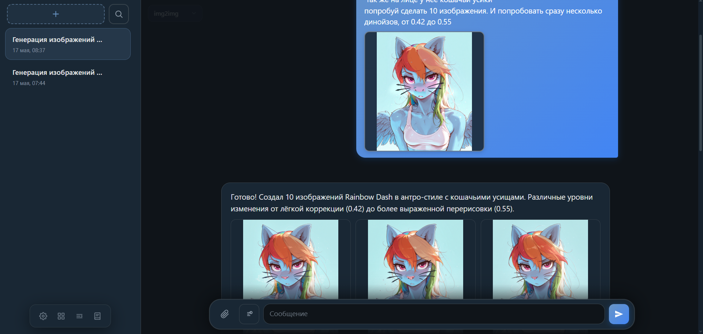

# web-chat


**Локальный веб-чат с AI-агентом**, генерацией изображений через Stable Diffusion WebUI и встроенным MCP. Один процесс FastAPI обслуживает интерфейс в браузере, REST/WebSocket API, оркестрацию LLM, вызов инструментов и раздачу медиа. Рассчитан на домашнюю или офисную сеть (LAN); при необходимости — доступ через WireGuard.

<p align="center">
  <a href="docs/images/ui-overview.png" title="Открыть в полном размере">
    
  </a>
</p>

<p align="center"><em>Главный экран: список бесед, история сообщений, поле ввода с вложениями, выбор пресета (режима агента).</em></p>

---

## Содержание

1. [Кратко о возможностях](#кратко-о-возможностях)
2. [Требования и быстрый старт](#требования-и-быстрый-старт)
3. [Архитектура](#архитектура)
4. [Интерфейс](#интерфейс)
5. [Беседы и сообщения](#беседы-и-сообщения)
6. [Пресеты (режимы агента)](#пресеты-режимы-агента)
7. [Вложения и медиа](#вложения-и-медиа)
8. [Генерация изображений](#генерация-изображений)
9. [Галерея](#галерея)
10. [Быстрые промпты (@alias)](#быстрые-промпты-alias)
11. [Настройки и журнал](#настройки-и-журнал)
12. [WebSocket-протокол](#websocket-протокол)
13. [REST API](#rest-api)
14. [Конфигурация (.env)](#конфигурация-env)
15. [MCP-сервер](#mcp-сервер)
16. [Деплой и эксплуатация](#деплой-и-эксплуатация)
17. [Разработка и тесты](#разработка-и-тесты)
18. [Частые проблемы](#частые-проблемы)
19. [Документация в репозитории](#документация-в-репозитории)

---

## Кратко о возможностях

| Область | Что умеет |
|---------|-----------|
| **Чат** | Несколько бесед, стриминг, поиск, экспорт Markdown, scroll persistence |
| **Пресеты** | default, txt2img, img2img, document_analysis |
| **Вложения** | Vision, PDF, DOCX, TXT; drag-and-drop; до 10 файлов |
| **SD** | `generate_image`, `img2img`, `upscale_images` |
| **Галерея** | До 1000 картинок, очистка сирот, purge all |
| **@alias** | Быстрые промпты; режимы selected / full / semantic |
| **RAG** | Поиск по документам беседы (при `RAG_ENABLED`), UI-переключатель |
| **Пользователи** | Login/password, изоляция бесед, admin API (опционально `AUTH_ENABLED`) |
| **UX** | Тёмная/светлая тема, lightbox, черновики, resume после F5 |
| **Операции** | systemd, Postgres/SQLite, backup БД, retention, WireGuard |

---

## Требования и быстрый старт

### Требования

- **Python 3.11+**, Linux
- **RAM:** от 2 GB (рекомендуется 4 GB+)
- **LLM** с OpenAI-compatible API (llama.cpp server, vLLM, и т.п.)
- **Stable Diffusion WebUI** (Automatic1111 / Forge) с флагом `--api`
- Хост LLM должен **по HTTP** достучаться до `PUBLIC_BASE_URL` (для vision по URL картинок)

### Установка (разработка)

```bash
cd /opt/web-chat   # или ваш путь

cp .env.example .env
# Обязательно: PUBLIC_BASE_URL = тот же хост:порт, что открываете в браузере

./deploy/install.sh --skip-systemd --dev-deps
./restart.sh dev
```

Откройте в браузере: `http://<IP-сервера>:8090/` (порт из `WEB_PORT`).

Проверка:

```bash
curl -s http://127.0.0.1:8090/api/health | jq
```

### Production (systemd)

```bash
sudo ./deploy/install.sh
sudo systemctl status web-chat
./restart.sh status
```

Подробно: [deploy/DEPLOY.md](deploy/DEPLOY.md).

---

## Архитектура

```text
Браузер (LAN / VPN)
    │  HTTP :8090   — HTML, REST, /media/*
    │  WS  /ws/{conversation_id}
    ▼
┌─────────────────────────────────────────┐
│  web-chat (FastAPI + Uvicorn)           │
│  ├── AgentOrchestrator → LLM (stream)   │
│  ├── ToolExecutor → SD / extract_text   │
│  ├── AssistantStreamDraft → SQLite      │
│  └── MCP :8091 (streamable-http)        │
└─────────────────────────────────────────┘
    │                    │
    ▼                    ▼
 SQLite              SD WebUI :7860
 data/uploads/       (txt2img, img2img)
 data/generated/
```

### Важные принципы

1. **В контекст LLM не попадает base64** — только HTTP URL (`PUBLIC_BASE_URL` + `/media/asset/{uuid}` или `/media/asset/{uuid}/llm` для vision).
2. **Инструменты in-process** — оркестратор вызывает `ToolExecutor` напрямую; отдельный MCP нужен внешним клиентам (Cursor и т.д.).
3. **Картинки в чате** — в `content_json.images` и сетке `.message-images`; ассистент не должен вставлять markdown `` (постобработка убирает такие вставки).
4. **img2img исходник** — пиксели в SD идут с диска/БД; vision нужен модели только для смысла (промпт, denoise). Сервер при наличии вложения в user-сообщении **закрепляет init** и игнорирует неверный URL от модели.

---

## Интерфейс

### Макет

| Зона | Элементы |
|------|----------|
| **Слева** | Список бесед, поиск по истории, кнопка «Новая беседа», удаление (двойной клик) |
| **Центр** | Лента сообщений (user / assistant), статус генерации в пузыре ассистента |
| **Снизу** | Полоса вложений, скрепка, `@`-макросы, поле ввода (1–10 строк), Send / Stop |
| **Сверху** | Пресет беседы, шестерёнка (настройки), галерея, журнал |

На узком экране боковая панель открывается жестом / кнопкой «меню».

### Поле ввода

- **Enter** — отправить; **Shift+Enter** — новая строка.
- Высота поля растёт по содержимому (до 10 строк), затем внутренний скролл.
- **Черновик неотправленного сообщения** сохраняется в `localStorage` **отдельно для каждой беседы** (`webchat_composer_drafts_v1`): текст и список прикреплённых файлов (по id с сервера). Черновик живёт, пока вы не отправите сообщение и не удалите беседу. Переход на `/gallery` или `/macros` и возврат — черновик восстанавливается.
- Во время генерации **Send** скрыт, **Stop** отменяет запрос; поле ввода остаётся доступным (можно набрать следующий вопрос).

### Действия с сообщением

Наведите на сообщение — появится панель:

| Кнопка | User | Assistant |
|--------|------|-----------|
| Копировать текст | ✓ | ✓ |
| Редактировать | ✓ (текст + вложения в composer) | ✓ (только текст) |
| Перегенерировать | ✓ (ответ ассистента заново) | ✓ (перегенерация этого ответа) |
| Удалить | ✓ (с удалением ответов после) | ✓ (только это сообщение) |

**Редактирование user-сообщения:** вложения подгружаются в полосу прикреплений; их можно удалить или добавить новые. **Enter** — сохранить и перегенерировать ответ ассистента; **Escape** — отмена.

### Lightbox (просмотр картинки)

Клик по изображению в чате или галерее:

- Листание prev/next, свайп на телефоне, **Escape** — закрыть.
- **Скрепка** (верхний левый угол) — прикрепить картинку в поле ввода текущей беседы.
- **Скачать** — сохранить PNG на диск.

### Возобновление после F5

Если обновить страницу во время генерации:

1. Сервер хранит **черновик assistant** в SQLite (`content_json.streaming`, фаза, картинки).
2. При подключении WS приходит `connected` с `in_progress` и `streaming_message_id`.
3. Клиент подгружает историю и продолжает показывать статус / картинки (poll ~2 с).

---

## Беседы и сообщения

### Создание и выбор

- **Новая беседа** — модальное окно: название (опционально) и пресет.
- Текущая беседа запоминается в `localStorage` (`webchat_conv_id`).
- Заголовок можно менять в настройках (поле «Название беседы») или получить автоматически после первых сообщений (LLM).

### История

- В LLM уходит до `MAX_HISTORY_MESSAGES` последних сообщений (по умолчанию 60).
- Сообщения user хранят `content_json.parts` (текст + `image_url` + подсказки img2img).
- Сообщения assistant — текст, `tool_calls`, массив `images` / `image_asset_ids`.

### Экспорт и поиск

- **Экспорт** — `GET /api/conversations/{id}/export` → Markdown (кнопка в настройках).
- **Поиск** — иконка лупы в сайдбаре; ищет по `content_text` во всех беседах.

---

## Пресеты (режимы агента)

Пресет задаёт **системный промпт** и **какие инструменты** видит модель. Переключить можно при создании беседы или в выпадающем списке над чатом (сохраняется через PATCH беседы).

| Slug | Название (пример) | Инструменты | Назначение |
|------|-------------------|-------------|------------|
| `default` | По умолчанию | Все | Обычный ассистент + документы + SD при необходимости |
| `image_gen` | Генерация с нуля (txt2img) | `generate_image`, `upscale_images`, `get_gallery`, `extract_text` | Новые картинки по описанию |
| `img2img` | Перерисовка (img2img) | `img2img`, `upscale_images` | Доработка **существующего** изображения |
| `document_analysis` | Анализ документов | `extract_text` | Работа с PDF/DOCX/TXT |

Тексты промптов — эталон в [Sys-prompt.md](Sys-prompt.md), в БД — через `app/db/seed.py`. Редактирование промпта пресета в UI (настройки) с черновиками в `localStorage` до сохранения на сервер.

### Когда какой пресет

- **Новая картинка по тексту** → `image_gen`, инструмент `generate_image`.
- **Изменить приложенную / последнюю картинку** → `img2img`, обязательно вложение или URL из истории.
- **Референс во вложении, но новая сцена** → обычно `image_gen` (модель опишет видимое и сгенерирует с нуля).
- **Только документ** → `document_analysis` или `default` + `extract_text`.

---

## Вложения и медиа

### Поддерживаемые типы

| Тип | MIME (примеры) | В чате | В LLM |
|-----|----------------|--------|-------|
| Изображения | jpeg, png, webp, gif | Превью | `image_url` → vision (`/media/asset/{id}/llm`) |
| PDF | application/pdf | Иконка файла | `extract_text` |
| DOCX | wordprocessingml | Иконка | `extract_text` |
| TXT, CSV | text/plain, text/csv | Иконка | `extract_text` |

Лимиты (по умолчанию): **25 MB** на файл, **10 файлов** на одно сообщение (`MAX_UPLOAD_MB`, `MAX_FILES_PER_MESSAGE`).

### Загрузка

1. Выберите или создайте беседу (composer должен быть виден).
2. Скрепка или перетаскивание в зону ввода → `POST /api/upload`.
3. Файлы появляются чипами над полем ввода; удаление — «×» на чипе.

Изображения сохраняются в **MediaAsset** (SQLite); документы — в `data/uploads/{attachment_id}/`.

### URL медиа

| Путь | Назначение |
|------|------------|
| `/media/asset/{uuid}` | Картинка из БД (чат, галерея) |
| `/media/asset/{uuid}/llm` | Версия для vision (сжатие JPEG, лимит байт) |
| `/media/uploads/{att_id}/{filename}` | Документы на диске |
| `/media/generated/{filename}` | Локальные PNG до ingest (после ingest — обычно asset) |

**Критично:** `PUBLIC_BASE_URL` в `.env` должен совпадать с URL в браузере. Иначе картинки в чате и vision у LLM не сработают.

Опционально `PUBLIC_BASE_URL_VPN` — если LLM в другой подсети (WireGuard).

### Контекст беседы для LLM (память диалога)

История **не хранится в RAM процесса** — только в SQLite (`messages`, `content_json.parts` для user, `images` / `image_asset_ids` для assistant).

При каждом новом сообщении сервер:

1. Читает последние `MAX_HISTORY_MESSAGES` (по умолчанию 60) user/assistant из БД.
2. Собирает multimodal-контент: **ваши картинки** из `parts` → vision URL `/llm`; **картинки ассистента** из прошлых ответов — тоже в контекст (vision).
3. Добавляет system prompt пресета (+ опционально каталог `@alias` при `macro_context=full`).

**После перезапуска сервера** контекст восстанавливается из БД автоматически — достаточно открыть беседу и продолжить.

| Сценарий | Как продолжить |
|----------|----------------|
| Веб-UI | Открыть беседу → WS `user_message` (как обычно) |
| Внешнее приложение | `POST /api/conversations/{id}/turn` + poll `generation-status` и `GET .../messages` |
| Проверить, что увидит модель | `GET /api/conversations/{id}/llm-context` |

Прерванная генерация: черновик assistant остаётся в БД; UI подхватывает через `generation-status` и WS `connected`.

---

## Генерация изображений

Требуется доступный **SD WebUI** (`SD_WEBUI_URL`, таймаут `REQUEST_TIMEOUT`).

### txt2img (`generate_image`)

- Пресет **`image_gen`**.
- Параметры: prompt, negative_prompt, width/height, steps, cfg, sampler, **count 1–10** за один вызов.
- Результат попадает в чат автоматически (WS `image` + `content_json.images`).

### img2img (`img2img`)

- Пресет **`img2img`**.
- Обязателен исходник: **вложение в сообщении** или `init_image_url` / `attachment_id` из подсказки в тексте.
- **denoising_strength** (0.2–0.92): чем выше, тем сильнее отход от оригинала; по умолчанию **0.54**.
- **`denoising_strengths`** — массив до **12** значений за **один** вызов с тем же init (удобно для сравнения 0.5, 0.6, 0.7…).
- **width/height = 0** — размер как у исходника (после нормализации 512–2048, кратно 8).

#### Нюансы img2img (важно)

1. Сервер **закрепляет init** из user-сообщения на весь ход (несколько вызовов подряд используют один и тот же файл).
2. Модель **не «видит»** результат img2img глазами в том же turn — в tool-ответ приходит текст с URL; картинка появляется у пользователя сразу.
3. При **denoise > ~0.75** результат визуально похож на новую генерацию, но в метаданных PNG остаётся img2img.
4. Не делайте 10 отдельных вызовов img2img для сравнения denoise — лучше один вызов с `denoising_strengths: [0.5, 0.55, …]`.
5. Лимит **10 раундов** инструментов за сообщение (`MAX_TOOL_ROUNDS`); при исчерпании сохраняется частичный результат с пояснением в тексте.

### Upscale

- `upscale_images` — увеличение через SD extras (доступные upscaler’ы смотрятся в WebUI).
- URL только доверенные: `/media/generated/…` или имена файлов на диске.

### Где лежат файлы

- После генерации: сначала `data/generated/`, затем **ingest** в `MediaAsset`.
- Старые файлы на диске чистятся по `GENERATED_RETENTION_DAYS` (timer + systemd).

---

## Галерея

Страница **`/gallery`** — до **1000** последних изображений (записи в БД + файлы в `data/generated/` без дубликатов).

- Сетка превью, клик — lightbox.
- **Скачать** — сохранить файл.
- **В чат** — создаётся новая беседа, файл загружается как вложение, переход на главную (вложения восстанавливаются из `sessionStorage`).

Обновление списка: автоматически по таймеру и после действий.

---

## Быстрые промпты (@alias)

### В чате

- Введите **`@`** в поле ввода — автодополнение по alias.
- Выбор подставляет текст макроса; в UI отображается **спойлер** (`<details>`), в LLM уходит полный текст из макроса.
- Синтаксис **`@@alias`** в поле показывает один `@` (визуальная подсказка).

### Страница `/macros`

CRUD макросов: категории (персонаж, стиль, сцена…), alias, тело текста, порядок сортировки.

REST: `/api/prompt-macros`, `GET /api/prompt-macros/search?q=`, `POST /api/prompt-macros/reindex-embeddings`.

Кнопка каталога в composer (цикл): только `@` из текста → полный каталог → **semantic** top-K по запросу (`macro_context` в WS). Векторы: `EMBEDDING_MODEL` в `.env`, offline reindex.

---

## Настройки и журнал

Панель **настроек** (шестерёнка):

| Блок | Описание |
|------|----------|
| Название беседы | PATCH беседы |
| Экспорт | Markdown всей истории |
| Пресет (редактор) | Изменение `system_prompt`, «сделать пресетом по умолчанию» |
| Модель LLM | Override или «как на сервере» |
| URL LLM / SD | Сохраняются в `localStorage`, передаются в WS при отправке |
| Тема / шрифт | `localStorage` |
| Сохранить | Запись настроек пресета + отображение |

**Журнал** — кольцевой буфер логов приложения + опрос `/api/logs`; копирование и очистка.

### Переопределение LLM/SD из UI

При отправке сообщения в WebSocket можно передать (необязательно):

- `llm_base_url`
- `sd_webui_url`
- `model`

Это позволяет одному серверу web-chat ходить в разные бэкенды без правки `.env`.

---

## WebSocket-протокол

**Подключение:** `ws://<host>:<port>/ws/{conversation_id}`

### Клиент → сервер

| type | Поля | Описание |
|------|------|----------|
| `user_message` | `text`, `attachment_ids[]`, опционально `llm_base_url`, `sd_webui_url`, `model`, `macro_context`, `document_rag` | Новый запрос |
| `cancel` | — | Отмена генерации |
| `regenerate` | `message_id`, опционально overrides | Перегенерация |
| `ping` | — | Keepalive → `pong` |

`macro_context`: `selected` (default) \| `full` \| `semantic`.  
`document_rag`: `true` — подмешать top-K фрагментов документов (если `RAG_ENABLED` на сервере).

### Сервер → клиент

| type | Поля | Описание |
|------|------|----------|
| `connected` | `conversation_id`, `in_progress`, `streaming_message_id`, `phase`, `active_tool` | Подключение + resume |
| `assistant_draft` | `assistant_message_id` | Создан черновик assistant в БД |
| `ack` | `user_message_id` | User-сообщение сохранено |
| `text_delta` | `content` | Часть текста |
| `tool_start` / `tool_done` | `name`, … | Инструменты |
| `image` | `urls[]` | Новые картинки в текущий пузырь |
| `error` | `message`, `code` | Ошибка |
| `done` | `assistant_message_id`, `conversation_title?` | Конец хода |

Коды ошибок: `cancelled`, `tool_loop`, `llm_error`, `validation`, `internal`.

Событие **`image`** может прийти **до** окончания текста — превью появляются сразу в `.message-images`.

---

## REST API

Префикс: **`/api`**. OpenAPI: `/docs` (если включено в режиме dev).

### Основные маршруты

| Метод | Путь | Описание |
|-------|------|----------|
| GET | `/health` | LLM, SD, `timeouts_ok`, disk, WS |
| GET | `/config` | Публичные лимиты, `auth_enabled`, `rag_enabled` |
| POST | `/auth/login`, `/auth/logout` | Сессия (при `AUTH_ENABLED`) |
| GET | `/auth/me` | Текущий пользователь |
| GET/POST | `/users` | Список / создание (admin) |
| GET/POST | `/conversations` | Список / создание |
| GET/PATCH/DELETE | `/conversations/{id}` | Беседа |
| GET | `/conversations/{id}/messages` | История (`?limit=`, `?before=`) |
| GET | `/conversations/{id}/llm-context` | Контекст для LLM из БД (после рестарта сервера) |
| POST | `/conversations/{id}/turn` | Запуск хода из внешнего приложения (202, без WS) |
| GET | `/conversations/{id}/generation-status` | Resume UI |
| GET | `/conversations/{id}/export` | Markdown |
| PATCH/DELETE | `/conversations/{id}/messages/{msg_id}` | Редактирование / удаление |
| GET | `/conversations/{id}/messages/{msg_id}/attachments` | Вложения сообщения (для редактирования) |
| GET | `/search?q=` | Поиск по истории |
| GET | `/conversations/{id}/document-search?q=` | RAG по документам беседы |
| POST | `/attachments/{id}/index-rag` | Индексация документа для RAG |
| GET/POST/PATCH/DELETE | `/prompt-macros` | Макросы |
| GET | `/presets` | Пресеты |
| POST | `/upload` | Загрузка файлов (`files`, `conversation_id`) |
| GET | `/config` | Лимиты и часовой пояс для UI |
| GET | `/gallery` | JSON галереи |
| GET/DELETE | `/gallery/db/{asset_id}`, `/gallery/disk/{filename}` | Удаление из галереи |
| GET | `/logs` | Журнал сервера |

### Страницы (HTML)

| Путь | Страница |
|------|----------|
| `/` | Чат |
| `/gallery` | Галерея |
| `/macros` | Редактор макросов |

---

## Конфигурация (.env)

Полный пример: [.env.example](.env.example).

### Критичные переменные

| Переменная | Назначение |
|------------|------------|
| `PUBLIC_BASE_URL` | URL в браузере; для ссылок на картинки и vision |
| `PUBLIC_BASE_URL_VPN` | Альтернативный URL для LLM в VPN |
| `WEB_PORT` | HTTP (по умолчанию 8090) |
| `MCP_PORT` | MCP (0 = WEB_PORT + 1) |
| `LLM_BASE_URL` | OpenAI-compatible endpoint |
| `LLM_MODEL` | Модель по умолчанию (можно пусто — autodetect) |
| `SD_WEBUI_URL` | SD WebUI с `/sdapi/v1` |
| `REQUEST_TIMEOUT` | HTTP к SD (сек) |
| `MCP_TIMEOUT` | Должен быть **больше** REQUEST_TIMEOUT |

### Лимиты и поведение

| Переменная | По умолчанию | Смысл |
|------------|--------------|--------|
| `MAX_UPLOAD_MB` | 25 | Размер файла |
| `MAX_FILES_PER_MESSAGE` | 10 | Вложений на сообщение |
| `MAX_TOOL_ROUNDS` | 10 | Раундов LLM↔tools за один запрос |
| `MAX_HISTORY_MESSAGES` | 60 | Сообщений в контексте |
| `MAX_EXTRACT_CHARS` | 50000 | Обрезка extract_text |
| `LLM_VISION_MAX_BYTES` | 6 MiB | Сжатие для `/llm` URL |
| `UPLOAD_RETENTION_DAYS` | 7 | Очистка uploads |
| `GENERATED_RETENTION_DAYS` | 30 | Очистка generated |
| `DISPLAY_TIMEZONE` | Europe/Moscow | Время в UI (пусто = TZ браузера) |

### SD по умолчанию

`SD_STEPS`, `SD_SAMPLER`, `SD_SCHEDULE_TYPE`, `SD_CFG_SCALE`, `SD_WIDTH`, `SD_HEIGHT`, `SD_NEGATIVE_PROMPT` — дефолты для инструментов, если модель не передала свои.

---

## MCP-сервер

Параллельно поднимается **MCP** (Streamable HTTP) на порту `MCP_PORT` — те же инструменты, что и в чате (`generate_image`, `img2img`, `extract_text`, …).

Использование: внешние агенты (IDE, скрипты). Сам чат MCP **не вызывает** по сети — только `ToolExecutor`.

---

## Деплой и эксплуатация

| Действие | Команда / файл |
|----------|----------------|
| Установка | `sudo ./deploy/install.sh` |
| Перезапуск | `./restart.sh` или `systemctl restart web-chat` |
| Логи dev | `logs/uvicorn.log` |
| Backup / restore БД | `scripts/backup-database.sh`, `scripts/restore-database.sh` → [deploy/DATABASE-BACKUP.md](deploy/DATABASE-BACKUP.md) |
| Очистка файлов | `web-chat-cleanup.timer` |
| VPN в LXC | [deploy/wireguard/proxmox-lxc.md](deploy/wireguard/proxmox-lxc.md) |

После смены `.env` нужен перезапуск сервиса.

---

## Разработка и тесты

```bash
source .venv/bin/activate
ruff check app tests
pytest -q          # 254 теста
```

### Структура репозитория

```text
app/
  api/              REST, WebSocket, pages
  services/         orchestrator, media, gallery, macros, streaming_draft
  integrations/     llm_client, sd_tools, tool_executor, MCP
  db/               models, repositories, seed, migrate
static/
  js/chat.js        основной UI
  css/chat.css
templates/          chat.html, gallery.html, macros.html
deploy/             install.sh, systemd templates, DEPLOY.md
docs/images/        скриншоты для README
tests/
```

### Миграции и данные

- **PostgreSQL** (production): `DATABASE_URL=postgresql+asyncpg://…`, Alembic — [deploy/POSTGRES.md](deploy/POSTGRES.md).
- **SQLite** (резерв / dev): `data/db/web_chat.sqlite` — не удалять после миграции; бэкап включается в `backup-all.sh`.
- Первый запуск: seed пресетов из `app/db/seed.py`.
- Обновление промптов в существующей БД: `app/db/migrate.py`.
- Legacy user-сообщения без `parts`: `python -m app.scripts.migrate_missing_parts`.

---

## Частые проблемы

| Симптом | Что проверить |
|---------|----------------|
| Картинки не открываются | `PUBLIC_BASE_URL` = URL в адресной строке; LLM достучится до хоста |
| Vision не видит фото | URL `/media/asset/{id}/llm` доступен с хоста LLM; размер после сжатия < `LLM_VISION_MAX_BYTES` |
| img2img «как с нуля» | denoise слишком высокий; проверьте метаданные PNG (`Denoising strength`); используйте один init |
| Дубли сообщений assistant | Обновите до актуальной версии (фикс финализации черновика при лимите tools) |
| После F5 пропал статус | `/api/conversations/{id}/generation-status`; WS `connected.in_progress` |
| Прикрепление не работает | Выбрана беседа; смотрите баннер ошибки; лимит 10 файлов |
| SD timeout | Увеличить `REQUEST_TIMEOUT` / `MCP_TIMEOUT`; проверить GPU |
| «Лимит шагов с инструментами» | `MAX_TOOL_ROUNDS`; упростите запрос или используйте batch-параметры |

---

## Документация в репозитории

| Файл | Содержание |
|------|------------|
| [TODO.md](TODO.md) | Архитектура, этапы 1–11, §21 выполненное, §22 план |
| [audit.md](audit.md) | Сводный аудит + таблица статуса (исторические разборы ниже) |
| [SECURITY.md](SECURITY.md) | Auth, rate limit, proxy |
| [deploy/AUTH.md](deploy/AUTH.md) | Login, сессии, multi-user |
| [deploy/POSTGRES.md](deploy/POSTGRES.md) | PostgreSQL, ETL |
| [deploy/RAG.md](deploy/RAG.md) | RAG по документам |
| [deploy/DATABASE-BACKUP.md](deploy/DATABASE-BACKUP.md) | Backup/restore БД |
| [Sys-prompt.md](Sys-prompt.md) | Эталонные системные промпты |
| [deploy/DEPLOY.md](deploy/DEPLOY.md) | Production, systemd |
| [docs/images/](docs/images/) | Скриншоты UI |

При изменении системных промптов: сначала **Sys-prompt.md**, затем `app/db/seed.py` и миграция БД (см. TODO.md §6).

---

## Статус

- Этапы **1–11** и стабилизация **P0–P2 (пилот)** реализованы.
- **254** автотеста (`pytest -q`).
- Для production: включите `AUTH_ENABLED`, `AUTH_SECRET`, reverse proxy; см. [SECURITY.md](SECURITY.md). Не выставляйте порт в открытый интернет без HTTPS и защиты.
