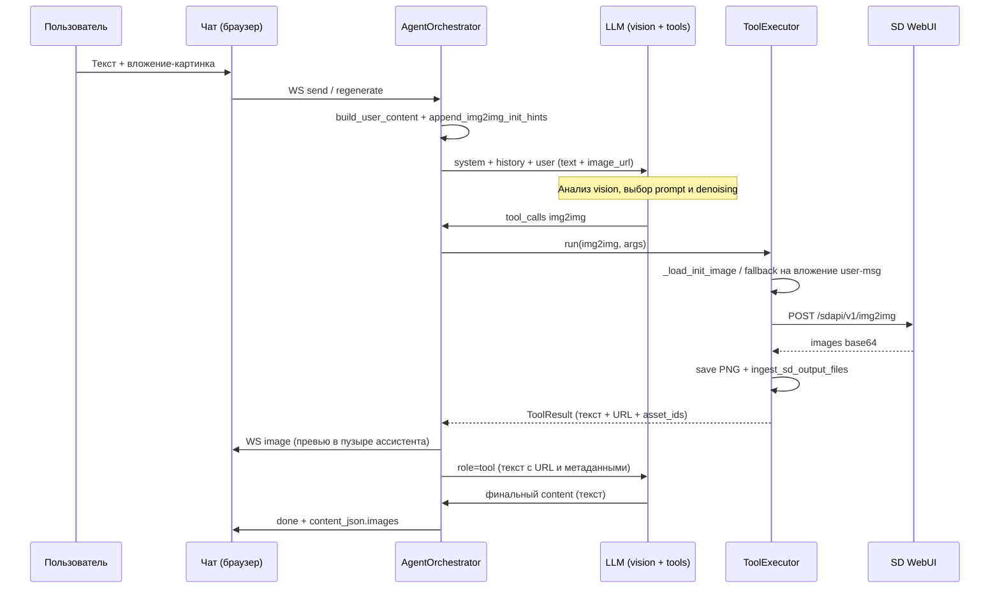

# web-chat — архитектура, принципы и план разработки

> **Домашняя директория проекта:** `/root/web-chat`  
> **Язык:** Python 3.11+  
> **Назначение документа:** единый гайдлайн для всех, кто создаёт и сопровождает проект.  
> Читать последовательно; этапы выполнять **по порядку**, не перескакивая без завершения критериев готовности.

> **Статус реализации (2026-05-23):** этапы **1–11** выполнены; **P0/P1** по [TODO-2](TODO-2.md) (turn_phase, flush 2KB, тесты WS/XSS/load). Автотесты: **182** (`pytest -q`), [§14.4](#144-парадигма-pytest-обязательно-для-новых-тестов). Журнал — [ниже](#журнал-прогресса).

> **Системные промпты:** эталонные тексты пресетов (txt2img, img2img, default, document_analysis) — в [`Sys-prompt.md`](Sys-prompt.md).  
> При любых правках промптов, инструментов или поведения агента **сначала** сверяйся с `Sys-prompt.md`, затем переноси изменения в `app/db/seed.py` и при необходимости в `app/db/migrate.py` (обновление существующей БД).

---

## Содержание

0. [Видение и цели](#0-видение-и-цели)  
1. [Архитектура (высокий уровень)](#1-архитектура-высокий-уровень)  
2. [Принципы программирования](#2-принципы-программирования)  
3. [Структура пакета и декларативность](#3-структура-пакета-и-декларативность)  
4. [Этапы разработки (1–11)](#4-этапы-разработки-111)  
5. [Маппинг кода из существующих проектов](#5-маппинг-кода-из-существующих-проектов)  
6. [Системные промпты (seed)](#6-системные-промпты-seed)  
7. [Чеклист перед production](#7-чеклист-перед-production)  
8. [Риски и митигация](#8-риски-и-митигация)  
9. [AI-агент и tool calling (детально)](#9-ai-агент-и-tool-calling-детально) — в т.ч. [§9.5 Пайплайн img2img](#95-пайплайн-img2img-пресет-img2img)  
10. [Фронтенд: структура и поведение](#10-фронтенд-структура-и-поведение)  
11. [REST API: полные контракты](#11-rest-api-полные-контракты)  
12. [Интеграция с image-gen (192.168.88.16)](#12-интеграция-с-image-gen-1921688816)  
13. [Обработка ошибок](#13-обработка-ошибок)  
14. [Тестирование](#14-тестирование)  
15. [Деплой и сеть (LAN / WireGuard)](#15-деплой-и-сеть-lan--wireguard)  
16. [Seed-данные пресетов (полные тексты)](#16-seed-данные-пресетов-полные-тексты)  
17. [Дорожная карта v2](#17-дорожная-карта-v2)  
18. [Зависимости (requirements)](#18-зависимости-requirements)  
19. [Критерий готовности MVP](#19-критерий-готовности-mvp)  
20. [Доработки после MVP (итерации разработки)](#20-доработки-после-mvp-итерации-разработки)

---

## 0. Видение и цели

### 0.1. Что строим

**Монолитное Python-приложение** для работы в **локальной сети** (LAN, адреса вида `192.168.88.x`). Один процесс объединяет три логические роли:

> **Сеть и MVP:** на этапе MVP достаточно доступа по LAN (браузер → `http://<хост>:8090`). Настройку **WireGuard** не включаем в обязательные этапы 1–8 — только закладываем в архитектуру и документацию как целевой вариант удалённого доступа (см. [раздел 15](#15-деплой-и-сеть-lan--wireguard)).

| Компонент | Назначение | Где живёт в коде |
|-----------|------------|------------------|
| **Web-чат** | UI в браузере: беседы, вложения, стриминг, пресеты | `templates/`, `static/`, `app/api/websocket.py` |
| **AI-агент** | Оркестрация: история → LLM → tools → ответ | `app/services/agent_orchestrator.py` |
| **MCP-сервер (встроенный)** | Инструменты SD + документы; хранение и раздача PNG | `app/integrations/mcp_server.py`, `sd_tools.py` |

Внешние сервисы (уже развёрнуты, не входят в репозиторий web-chat):

| Сервис | URL | Роль |
|--------|-----|------|
| LLM (OpenAI-compatible) | `http://192.168.88.41:8989/v1/` | Чат, vision, function/tool calling |
| SD WebUI (Automatic1111, флаг `--api`) | `http://192.168.88.52:7860/` | txt2img, img2img, upscale |
| image-gen (референс) | `http://192.168.88.16:8081/mcp` | **Образец** реализации MCP+SD; в проде логика **переносится внутрь** web-chat |

#### Ключевой принцип из image-gen

> **В контекст LLM не попадает base64 изображений.**  
> MCP и агент возвращают только **текст + HTTP URL**.  
> Браузер и модель ссылаются на один и тот же `PUBLIC_BASE_URL`.

Это снижает расход контекста, ускоряет ответы и совпадает с проверенной архитектурой `/root/image-gen`.

### 0.2. Пользовательские сценарии (обязательные для MVP)

1. Пользователь в локальной сети открывает чат в браузере → создаёт беседу → пишет «нарисуй кота в космосе».
2. Агент вызывает LLM → модель запрашивает `generate_image` → MCP → SD → PNG в `data/generated/` → **ingest в SQLite** (`MediaAsset`) → URL `/media/asset/{uuid}` → события WS `image` и сетка `.message-images` под ответом. В `content_text` ассистента **нет** markdown `` — только обычный текст.
3. Пользователь прикрепляет PDF и/или изображения:
   - **изображения** → multimodal-сообщение в LLM (vision);
   - **PDF/DOCX/TXT** → извлечение текста **до** или **через** tool `extract_text`.
4. Несколько вложений и несколько сгенерированных изображений отображаются в одном ответе ассистента.
5. Пресет системного промпта выбирается при создании беседы; для новых бесед по умолчанию — пресет с `is_default=true` в БД.

### 0.3. Не-цели версии 1 (v1)

- Публичный доступ в интернет (внешний firewall / проброс портов на роутере).
- Полноценная настройка WireGuard в рамках MVP (достаточно LAN; WG — см. раздел 15).
- n8n и внешние оркестраторы (опционально позже).
- Отдельный SPA на React/Vue (достаточно Jinja2 + vanilla JS).
- Микросервисное разбиение на несколько репозиториев.
- RAG / embeddings по документам (отдельный проект v2).
- Обязательная замена image-gen на .16 до стабилизации web-chat (можно держать параллельно).

### 0.4. Референсные проекты

| Путь | Что берём |
|------|-----------|
| `/root/image-gen` | MCP+SD, сохранение файлов, `safe_filename`, streamable HTTP, галерея |
| `/root/prompt-extension` | UX чата: стриминг, markdown, error banner, reasoning, темы, пресеты в UI |

**Не копировать слепо:** prompt-extension завязан на Chrome Extension API (`chrome.runtime`, content script). В web-chat — только серверный API и WebSocket.

---

## 1. Архитектура (высокий уровень)

### 1.1. Схема системы

```
┌─────────────────────────────────────────────────────────────────┐
│  Браузер пользователя (LAN; позже — через WireGuard)             │
│  HTML / CSS / JS — UI на базе prompt-extension                   │
└────────────────────────────┬────────────────────────────────────┘
                             │ HTTP(S): REST + статика
                             │ WebSocket: /ws/{conversation_id}
                             ▼
┌─────────────────────────────────────────────────────────────────┐
│  web-chat — один процесс Uvicorn                                 │
│                                                                  │
│  ┌─────────────┐  ┌──────────────┐  ┌─────────────────────────┐ │
│  │ Web UI      │  │ REST API     │  │ WebSocket               │ │
│  │ GET /       │  │ /api/...     │  │ /ws/{id}                │ │
│  │ /static     │  │ /api/upload  │  │ стриминг ответа агента  │ │
│  │ /media/...  │  │ /health      │  └───────────┬─────────────┘ │
│  └─────────────┘  └──────────────┘              │               │
│                                                  ▼               │
│                    ┌─────────────────────────────────────────┐   │
│                    │ AgentOrchestrator                        │   │
│                    │  • сбор messages + tools                 │   │
│                    │  • commit user-msg до долгих tools/SD    │   │
│                    │  • цикл tool_calls (до MAX_TOOL_ROUNDS)  │   │
│                    │  • события в WebSocket                   │   │
│                    └───────┬─────────────────┬─────────────────┘   │
│                            │                 │                     │
│              ┌─────────────▼─────┐   ┌───────▼──────────────┐     │
│              │ LLMClient         │   │ ToolExecutor         │     │
│              │ OpenAI async SDK  │   │ in-process вызов     │     │
│              │ → 192.168.88.41   │   │ MCP-функций / extract  │     │
│              └───────────────────┘   └───────┬──────────────┘     │
│                                              │                     │
│                    ┌─────────────────────────▼──────────────┐     │
│                    │ FastMCP (streamable-http)  :8091/mcp      │     │
│                    │  generate_image, extract_text, …        │     │
│                    │  → POST SD WebUI 192.168.88.52          │     │
│                    │  → data/generated/ → ingest MediaAsset  │     │
│                    └─────────────────────────────────────────┘     │
│                                                                  │
│  ┌──────────────┐  ┌──────────────────────────────────────────┐  │
│  │ SQLite       │  │ Файлы + MediaAsset (BLOB в SQLite)        │  │
│  │ SQLAlchemy   │  │ uploads/ — документы; generated/ — SD     │  │
│  │ async + WAL  │  │ GET /media/asset/{id} — раздача из БД     │  │
│  └──────────────┘  └──────────────────────────────────────────┘  │
└─────────────────────────────────────────────────────────────────┘
         │                                    │
         ▼                                    ▼
  http://192.168.88.41:8989/v1/      http://192.168.88.52:7860/
```

### 1.2. Почему монолит, а не «чат + внешний MCP на .16»

| Аргумент | Пояснение |
|----------|-----------|
| Единый `PUBLIC_BASE_URL` | LLM, MCP и браузер отдают/запрашивают одни и те же URL картинок |
| Меньше сетевых сбоев | Нет лишнего hop «чат → 192.168.88.16 → SD» |
| Проверенный код | Портирование `image-gen` блоками, а не переписывание |
| Один systemd-unit | Проще деплой и логи на хосте в LAN |
| Endpoint `/mcp` | Остаётся для отладки (MCP Inspector) и внешних клиентов на переходный период |

**Исключение:** на этапе миграции image-gen на .16 может работать параллельно; история чата со старыми URL с .16 после миграции не будет открывать картинки — это ожидаемо.

### 1.3. Поток одного сообщения пользователя

```
1. Client: POST /api/upload (опционально) → attachment_ids[]
2. Client WS: { type: "user_message", text, attachment_ids }
3. Server:
   a. Валидация Pydantic
   b. Сохранить Message(role=user) в БД и **commit** (до долгих LLM/SD/tools — иначе SQLite lock)
   c. AttachmentService: подготовить vision URL / extracted_text
   d. AgentOrchestrator.run_turn(...)
4. Цикл агента:
   a. LLM.chat.completions(stream=True, messages, tools)
   b. Если tool_calls → ToolExecutor → результаты → messages += tool
   c. Повтор до финального текста или MAX_TOOL_ROUNDS
5. Server WS: text_delta | tool_* | image | done
6. Сохранить Message(role=assistant): `content_text` без markdown-картинок; `content_json` — `images`, `image_asset_ids`, tool_calls
```

### 1.4. Клиент–сервер: разделение ответственности

| Слой | Ответственность |
|------|-----------------|
| **Браузер** | Отображение, локальное состояние UI, WebSocket, markdown, превью файлов |
| **REST** | CRUD бесед, загрузка файлов, история при открытии вкладки, health |
| **WebSocket** | Только интерактивный turn (отправка сообщения + стриминг ответа) |
| **Agent** | Бизнес-логика LLM+tools, без знания о HTML |
| **MCP/SD** | Генерация файлов и текстовые отчёты с URL |

**Принцип:** после перезагрузки страницы история **всегда** восстанавливается через REST; WebSocket не хранит состояние между сессиями.

### 1.5. Протокол WebSocket

**Подключение:** `GET /ws/{conversation_id}`  
При подключении сервер может отправить `{ "type": "connected", "conversation_id": "..." }`.

#### Клиент → сервер

| type | Поля | Описание |
|------|------|----------|
| `user_message` | `text`, `attachment_ids[]` | Новый запрос пользователя |
| `cancel` | — | Отмена текущей генерации (LLM stream) |
| `regenerate` | `message_id` | Перегенерация ответа ассистента (удаление хвоста истории после user-msg) |
| `ping` | — | Keepalive; сервер отвечает `pong` |

#### Сервер → клиент

| type | Поля | Описание |
|------|------|----------|
| `connected` | `conversation_id`, `in_progress`, `streaming_message_id`, `phase`, `active_tool` | Подтверждение WS + состояние генерации для resume после F5 |
| `ack` | `user_message_id` | Сообщение пользователя сохранено |
| `text_delta` | `content` | Часть текста ассистента |
| `reasoning_delta` | `content` | Опционально: «размышления» модели |
| `tool_start` | `name`, `arguments` | Начало вызова инструмента |
| `tool_done` | `name`, `summary` | Краткий итог (без base64) |
| `image` | `urls[]`, `thumbs[]?` | Новые картинки для вставки в сообщение |
| `error` | `message`, `code` | Ошибка (см. раздел 13) |
| `done` | `assistant_message_id` | Turn завершён |
| `pong` | — | Ответ на ping |

**Нюанс:** событие `image` может прийти **до** финального `text_delta`, пока модель ещё генерирует текст. UI добавляет превью в сетку `.message-images` текущего пузыря ассистента, не дожидаясь `done`. Статус («Генерация…») — в `.message-status` внутри пузыря, не в отдельном footer.

### 1.6. Модель данных (SQLAlchemy 2.0, async)

```text
Preset
  id              UUID PK
  name            str          # «По умолчанию», «Генерация изображений»
  slug            str unique   # default, image_gen, document_analysis
  system_prompt   text         # полный системный промпт
  is_default      bool         # ровно один True в БД
  sort_order      int
  created_at      datetime

Conversation
  id              UUID PK
  title           str
  preset_id       FK → Preset
  created_at      datetime
  updated_at      datetime   # обновлять при новом сообщении

Message
  id              UUID PK
  conversation_id FK
  role            enum: user | assistant | system | tool
  content_text    text nullable    # плоский текст для поиска/отображения
  content_json    JSON nullable    # parts, tool_calls, image_urls, reasoning
  created_at      datetime

Attachment
  id              UUID PK
  conversation_id FK nullable    # привязка до отправки
  message_id      FK nullable    # после отправки
  original_name   str
  mime_type       str
  size_bytes      int
  storage_path    str            # документы: data/uploads/; image/* может быть в MediaAsset
  extracted_text  text nullable  # кэш после extract
  created_at      datetime

MediaAsset
  id              UUID PK
  conversation_id FK nullable
  mime_type       str
  data            bytes          # PNG/WebP в SQLite
  thumb_data      bytes nullable
  original_name   str nullable
  created_at      datetime
```

**Принцип нормализации:** `content_text` дублирует основной текст для простых запросов; полная структура — в `content_json`, чтобы не ломать multimodal при повторной загрузке истории.

### 1.7. Файловая система проекта

```text
/root/web-chat/
├── app/
│   ├── main.py, config.py, logging_buffer.py, constants.py
│   ├── db/           session, sqlite (WAL), migrate, models, repositories, seed
│   ├── api/
│   │   router.py, conversations.py, messages.py, presets.py, upload.py
│   │   media.py, health.py, logs_api.py, websocket.py, ws_manager.py
│   │   pages.py (/, /gallery, /macros), gallery.py, search.py
│   │   prompt_macros.py, config_api.py, schemas.py
│   ├── services/
│   │   agent_orchestrator.py, message_builder.py, attachment_service.py
│   │   media_service.py, streaming_draft.py, generation_state.py
│   │   prompt_macro_service.py, conversation_title_service.py
│   │   conversation_export_service.py, gallery_service.py, cleanup_service.py
│   │   retention_task.py, search_snippet.py
│   ├── integrations/
│   │   llm_client.py, llm_health.py, tool_executor.py, tool_definitions.py
│   │   mcp_server.py, sd_tools.py, sd_health.py, document_tools.py
│   │   document_extractor.py, media_utils.py, runtime_config.py
│   └── scripts/    run_cleanup.py, test_agent.py
├── static/css/chat.css
├── static/js/      chat.js, markdown.js, prompt-macros.js, macros-page.js, gallery.js
├── templates/      chat.html, gallery.html, macros.html
├── tests/          105 pytest (generation_state, prompt_macros, llm_vision, img2img, …)
├── deploy/
│   install.sh, DEPLOY.md, backup-data.sh
│   web-chat.service.template, web-chat-cleanup.service.template
│   web-chat-cleanup.timer, logrotate-web-chat.conf.template
│   web-chat.service (пример для /root/web-chat), generated/ (gitignore)
├── restart.sh
├── data/           runtime: db/, uploads/, generated/ (не в git)
├── logs/           uvicorn.log в dev (не в git)
├── .env.example, TODO.md, Sys-prompt.md, README.md
└── requirements.txt, requirements-dev.txt, pyproject.toml
```

Каталог `data/` в `.gitignore`; в репозитории только `.gitkeep` при необходимости.

### 1.8. Конфигурация (.env)

Все настройки — через **переменные окружения** и класс `Settings` (pydantic-settings). Никаких «магических» констант в середине модулей.

```env
# --- Сервер web-chat ---
WEB_HOST=0.0.0.0
WEB_PORT=8090
# URL, который видит БРАУЗЕР пользователя (критично для картинок!)
PUBLIC_BASE_URL=http://192.168.88.100:8090

# --- LLM ---
LLM_BASE_URL=http://192.168.88.41:8989/v1
LLM_API_KEY=
LLM_MODEL=                    # пусто = авто через GET /v1/models
LLM_TIMEOUT_SEC=300

# --- Stable Diffusion WebUI ---
SD_WEBUI_URL=http://192.168.88.52:7860
SD_AUTH_USER=
SD_AUTH_PASS=
REQUEST_TIMEOUT=600             # секунды, запрос к SD
MCP_TIMEOUT=900                 # должно быть > REQUEST_TIMEOUT

# --- БД и лимиты ---
DATABASE_URL=sqlite+aiosqlite:///./data/db/web_chat.sqlite
MAX_UPLOAD_MB=25
MAX_FILES_PER_MESSAGE=10
MAX_TOOL_ROUNDS=10
MAX_HISTORY_MESSAGES=60         # пар user/assistant в контекст LLM

# --- Хранение ---
UPLOAD_RETENTION_DAYS=7
GENERATED_RETENTION_DAYS=30
```

**Валидация при старте:** если `MCP_TIMEOUT <= REQUEST_TIMEOUT` — warning в лог (как в image-gen `validate_settings()`).

### 1.9. Интеграция LLM

- Клиент: `openai.AsyncOpenAI(base_url=..., api_key=...)`.
- Стриминг: `chat.completions.create(..., stream=True)`.
- Tools: JSON Schema в формате OpenAI; имена **совпадают** с MCP tools.
- Vision: предпочтительно `image_url` с `PUBLIC_BASE_URL/media/uploads/...`, не base64 (настраиваемый fallback `USE_BASE64_IMAGES=false`).

### 1.10. MCP и SD

- Библиотека: **FastMCP** (как image-gen).
- Transport: `streamable-http`, путь `/mcp`.
- Запуск: фоновый `threading.Thread` (daemon), основной поток — Uvicorn (паттерн из `image-gen/code/app/server.py`).
- Инструменты v1: `generate_image`, `extract_text`.
- Инструменты v2 (этап 11): `img2img`, `upscale_images`, `get_gallery`.

#### Пайплайн сгенерированных изображений (текущая реализация)

```text
generate_image (count 1–10, n_iter=count, batch_size=1)
  → SD WebUI → base64 → data/generated/{file}.png + thumbs/
  → ingest_sd_output_files → MediaAsset в SQLite
  → публичный URL: {PUBLIC_BASE_URL}/media/asset/{uuid}
  → content_json.images + image_asset_ids; WS type=image
  → UI: .message-images (не markdown в content_text)
```

Legacy `/media/generated/{file}` остаётся для отладки и импорта старых URL; в новых ответах ассистента предпочтителен `/media/asset/`.

#### Пайплайн img2img (пресет `img2img`, перерисовка вложения)

Краткая схема — в [§9.5](#95-пайплайн-img2img-пресет-img2img). Отличие от txt2img: исходник **уже есть** (вложение пользователя); LLM анализирует его через **vision**, собирает промпт и `denoising_strength`, затем вызывает tool `img2img`; SD получает **байты файла с сервера**, а не картинку «из головы» модели.

```text
user: текст + image (attachment → MediaAsset)
  → LLM vision (/media/asset/{id}/llm) + подсказки attachment_id / init_image_url
  → tool_call img2img(prompt, denoising_strength, init_image_url | attachment_id)
  → ToolExecutor: загрузка init (fallback на вложение user-сообщения)
  → SD POST /sdapi/v1/img2img → data/generated/ → ingest → /media/asset/{uuid}
  → role=tool: текст + URL; WS image + content_json.images в ответе ассистента
  → (опционально) ещё раунд LLM — финальный текст пользователю
```

Пресеты разделены: `image_gen` → только `generate_image`; `img2img` → только `img2img` (+ upscale, gallery). Фильтр tools: `tools_for_preset_slug()` в `agent_orchestrator.py`.

### 1.11. Обработка вложений

| MIME / тип | Действие до LLM | Tool |
|------------|-----------------|------|
| `image/*` | URL в multimodal `content` | — |
| `application/pdf` | PyMuPDF → текст в `content` | `extract_text` при необходимости |
| DOCX | `python-docx` | то же |
| `text/*`, csv | чтение файла | то же |
| прочее | отклонить на upload с 415 | — |

**Два пути для документов (осознанно):**

1. **Eager (рекомендуется):** `AttachmentService` извлекает текст сразу после upload или перед `run_turn` — модель всегда видит документ.
2. **Lazy (tool):** модель сама вызывает `extract_text(attachment_id)` — для больших файлов или уточняющих вопросов.

### 1.12. Безопасность

**MVP (LAN):**

- Сервис слушает `0.0.0.0` или IP хоста в локальной сети; не пробрасывать порт на интернет без необходимости.
- Доверять сегменту LAN (домашняя/лабораторная сеть с LLM и SD).

**Позже (WireGuard):**

- Вынести UI за VPN; снаружи — только WG, без публичного HTTP.
- Те же правила `PUBLIC_BASE_URL`: URL в ответах должны быть достижимы из браузера пользователя (уже через туннель).

**Всегда:**
- `safe_filename()` + `Path.resolve().is_relative_to()` для всех путей (порт из image-gen).
- MCP: запрет внешних URL в `img2img`/upscale — только `PUBLIC_BASE_URL` и локальные имена файлов.
- Санитизация HTML на клиенте (`sanitizeHtml` из prompt-extension).
- Секреты только в `.env`, файл в `.gitignore`.
- Rate limit (in-memory): `POST /api/upload`, `POST /api/conversations`, WS `user_message` — см. [SECURITY.md](SECURITY.md), `.env` `RATE_LIMIT_*` (2026-05-23).
- API key (опционально): `API_ACCESS_KEY` + `TRUSTED_WS_ORIGINS` — см. [SECURITY.md](SECURITY.md).

---

## 2. Принципы программирования

### 2.1. PEP 8 и стиль Python

- Отступы 4 пробела; длина строки до 100–120 символов (зафиксировать в `pyproject.toml` / Ruff).
- Имена: `snake_case` для функций и переменных, `PascalCase` для классов, `UPPER_SNAKE` для констант модуля.
- Импорты: stdlib → third-party → local, разделены пустой строкой.
- Type hints на **всех** публичных функциях и методах.
- `from __future__ import annotations` в новых модулях для отложенных аннотаций.

### 2.2. Документация на русском языке

**Обязательно на русском:**

- Модульные docstring в начале каждого файла (кратко: назначение модуля).
- Docstring публичных классов и функций (Google style).
- Комментарии к нетривиальной логике (почему, а не что).

**Пример модуля:**

```python
"""
Оркестратор диалога с LLM и инструментами.

Отвечает за цикл: запрос к LLM → tool_calls → выполнение → повтор.
Не знает о WebSocket напрямую: получает callback для отправки событий.
"""
```

**Пример функции:**

```python
async def run_turn(
    self,
    conversation_id: uuid.UUID,
    user_text: str,
    attachment_ids: list[uuid.UUID],
    emit: EventEmitter,
) -> Message:
    """
    Выполнить один ход диалога (сообщение пользователя → ответ ассистента).

    Args:
        conversation_id: Идентификатор беседы.
        user_text: Текст сообщения пользователя.
        attachment_ids: Список UUID вложений, уже сохранённых через upload.
        emit: Async-функция для отправки событий в WebSocket (text_delta, image, …).

    Returns:
        Сохранённое сообщение ассистента с заполненным content_json.

    Raises:
        ToolLoopExceeded: Превышен лимит MAX_TOOL_ROUNDS.
        LLMError: Ошибка или таймаут LLM.
    """
```

**На английском допустимо:** имена переменных, поля JSON API, названия MCP tools (совместимость с SD/OpenAI).

### 2.3. Декларативный подход

| Область | Декларативно (что) | Императивно (как) — изолировать |
|---------|-------------------|----------------------------------|
| Конфиг | `Settings` в `config.py` | — |
| Схемы API | Pydantic models в `api/schemas.py` | — |
| ORM | SQLAlchemy `Mapped`, `mapped_column` | — |
| Tools для LLM | Список `TOOL_DEFINITIONS` | Выполнение в `ToolExecutor` |
| Маршруты | `APIRouter` декларации | Тонкие handlers → сервисы |
| MCP tools | `@mcp.tool()` декораторы | Тело вызывает SD |

**Правило:** роутер WebSocket не должен содержать цикл tool calling — только вызов `AgentOrchestrator.run_turn()`.

### 2.4. Слои и зависимости

```text
api/  →  services/  →  integrations/  →  db/
         ↓
      repositories (db)
```

- **api/** — HTTP/WS, валидация входа, коды ответов.
- **services/** — бизнес-логика, транзакции, оркестрация.
- **integrations/** — внешние системы (LLM, SD, файлы).
- **db/** — модели и запросы к БД.

**Запрещено:** импорт `api` из `integrations`; прямой SQL в роутерах.

### 2.5. Асинхронность

- FastAPI handlers и WS — `async def`.
- SQLAlchemy 2.0 — `AsyncSession`.
- HTTP к SD — `httpx.AsyncClient` (или `requests` в thread pool для портированного кода image-gen на первом этапе; затем мигрировать на httpx).
- Блокирующие вызовы (PIL, тяжёлый PDF) — `asyncio.to_thread()` чтобы не блокировать event loop.

### 2.6. Логирование

```python
logger = logging.getLogger(__name__)

logger.info(
    "Вызов инструмента %s, беседа=%s",
    tool_name,
    conversation_id,
    extra={"tool": tool_name, "conversation_id": str(conversation_id)},
)
```

Уровни: INFO — шаги пользователя; DEBUG — payload LLM (без секретов); WARNING — таймауты; ERROR — исключения с `exc_info=True`.

### 2.7. Обработка ошибок

- Пользователю — понятное сообщение на русском в WS `error` или HTTP JSON.
- Внутри — цепочка исключений (`LLMError`, `SDError`, `ValidationError`).
- Не глотать исключения без лога; не возвращать сырой traceback клиенту.

### 2.8. Тестируемость

- Сервисы принимают зависимости через конструктор (DI): `LLMClient`, `ToolExecutor`, `Session`.
- Для тестов — mock/fake LLM, фикстуры SQLite in-memory.

---

## 3. Структура пакета и декларативность

### 3.1. Точка входа `app/main.py`

```python
"""
Точка входа FastAPI-приложения web-chat.

Создаёт приложение, подключает роутеры, монтирует статику,
в lifespan — инициализация БД и запуск MCP в фоновом потоке.
"""

from contextlib import asynccontextmanager

from fastapi import FastAPI
from fastapi.staticfiles import StaticFiles

from app.api.router import api_router
from app.api.websocket import ws_router
from app.config import settings
from app.db.session import init_db
from app.integrations.mcp_server import start_mcp_background


@asynccontextmanager
async def lifespan(app: FastAPI):
  """Инициализация при старте и остановка при выключении."""
  await init_db()
  mcp_thread = start_mcp_background()
  yield
  # MCP daemon thread завершится вместе с процессом


def create_app() -> FastAPI:
  """Фабрика приложения (удобно для тестов)."""
  app = FastAPI(title="web-chat", lifespan=lifespan)
  app.include_router(api_router, prefix="/api")
  app.include_router(ws_router)
  app.mount("/static", StaticFiles(directory="static"), name="static")
  # /media — отдельный router с проверкой safe_filename
  return app


app = create_app()
```

### 3.2. Декларативный конфиг `app/config.py`

```python
"""
Настройки приложения из переменных окружения.

Все значения по умолчанию заданы здесь; переопределение — через .env.
"""

from pydantic_settings import BaseSettings, SettingsConfigDict


class Settings(BaseSettings):
  """Центральный конфиг web-chat."""

  model_config = SettingsConfigDict(
    env_file=".env",
    env_file_encoding="utf-8",
    extra="ignore",
  )

  web_host: str = "0.0.0.0"
  web_port: int = 8090
  public_base_url: str = "http://localhost:8090"

  llm_base_url: str = "http://192.168.88.41:8989/v1"
  llm_api_key: str = ""
  llm_model: str = ""
  llm_timeout_sec: int = 300

  sd_webui_url: str = "http://192.168.88.52:7860"
  request_timeout: int = 600
  mcp_timeout: int = 900

  database_url: str = "sqlite+aiosqlite:///./data/db/web_chat.sqlite"
  max_upload_mb: int = 25
  max_files_per_message: int = 10
  max_tool_rounds: int = 10
  max_history_messages: int = 60


settings = Settings()
```

### 3.3. Pydantic-схемы API (фрагмент)

```python
"""Схемы запросов и ответов REST API."""

from pydantic import BaseModel, Field
from uuid import UUID
from datetime import datetime


class ConversationCreate(BaseModel):
  """Тело запроса на создание беседы."""

  title: str | None = Field(None, max_length=200)
  preset_id: UUID | None = Field(
    None,
    description="Если не указан — используется пресет с is_default=true",
  )


class ConversationOut(BaseModel):
  """Беседа в ответе API."""

  id: UUID
  title: str
  preset_id: UUID
  created_at: datetime
  updated_at: datetime

  model_config = {"from_attributes": True}
```

---

## 4. Этапы разработки (1–11)

Каждый этап завершается только когда выполнены **все** пункты «Проверка».  
Отмечать прогресс: `[ ]` → `[x]`.

---

### Этап 1. Каркас проекта и конфигурация ✅

**Цель:** запускаемый FastAPI с health, настройками и структурой каталогов.

**Задачи:**

- [x] Создать дерево каталогов (раздел 1.7).
- [x] `pyproject.toml` — Ruff/black, pytest, Python >=3.11.
- [x] `requirements.txt` (раздел 18).
- [x] `app/config.py` — `Settings`, валидация `mcp_timeout > request_timeout`.
- [x] `app/main.py` — `create_app()`, `GET /health`.
- [x] `.env.example`, `.gitignore` (`data/`, `.env`, `__pycache__`, `.venv`).
- [x] `README.md` — как запустить, ссылки на LLM/SD URL.
- [x] `deploy/web-chat.service` — шаблон systemd.

**Реализовано сверх этапа 1:** `/health` проверяет LLM и SD (`status: ok | degraded`), не только живость процесса.

**Пример health (минимум этапа 1; в коде — расширенный):**

```python
@router.get("/health")
async def health() -> dict[str, str]:
  """Проверка живости процесса (без внешних зависимостей)."""
  return {"status": "ok"}
```

**Проверка:**

```bash
cd /root/web-chat && python -m venv .venv && source .venv/bin/activate
pip install -r requirements.txt
uvicorn app.main:app --host 0.0.0.0 --port 8090
curl -s http://localhost:8090/health
# → {"status":"ok"}
```

---

### Этап 2. База данных и REST для бесед ✅

**Цель:** CRUD бесед и пресетов без чата и WS.

**Задачи:**

- [x] `app/db/models.py` — Preset, Conversation, Message (полная модель).
- [x] `app/db/session.py` — `async_sessionmaker`, `init_db()` → `create_all`.
- [x] `app/db/repositories.py` — `ConversationRepository`, `PresetRepository`.
- [x] Seed при первом старте: 3 пресета (раздел 16), один `is_default=True`.
- [x] `GET/POST /api/conversations`, `GET/PATCH/DELETE /api/conversations/{id}`.
- [x] `GET /api/presets`.
- [x] `POST /api/presets/{id}/set-default` — переключить default для новых бесед.

**Дополнительно:** `migrate.py` (обновление пресетов в существующей БД), `sqlite.py` (WAL, retry записи).

**Нюанс:** при `POST /api/conversations` без `preset_id` — SQL:

```python
preset = await preset_repo.get_default()
if preset is None:
  raise HTTPException(500, "Не настроен пресет по умолчанию")
```

**Проверка:**

```bash
curl -X POST http://localhost:8090/api/conversations -H "Content-Type: application/json" -d '{}'
curl http://localhost:8090/api/conversations
curl http://localhost:8090/api/presets
```

---

### Этап 3. Загрузка файлов ✅

**Цель:** multipart upload, метаданные в БД, безопасная раздача.

**Задачи:**

- [x] Модель `Attachment`.
- [x] `POST /api/upload` — поле `files[]`, несколько файлов.
- [x] Валидация: размер, MIME whitelist, `max_files_per_message`.
- [x] Сохранение: `data/uploads/{attachment_id}/{safe_name}` (документы); изображения — также `MediaAsset`.
- [x] `GET /media/uploads/{attachment_id}/{filename}` — `FileResponse` после `safe_filename`.
- [x] `AttachmentService.register_upload()` — запись в БД.

**Пример проверки MIME:**

```python
ALLOWED_MIMES = frozenset({
  "image/jpeg", "image/png", "image/webp", "image/gif",
  "application/pdf",
  "application/vnd.openxmlformats-officedocument.wordprocessingml.document",
  "text/plain", "text/csv",
})
```

**Проверка:** загрузить PNG + PDF → получить два `id` → открыть preview URL для PNG в браузере.

---

### Этап 4. Встроенный MCP + SD (порт image-gen) ✅

**Цель:** генерация изображений из процесса web-chat.

**Задачи:**

- [x] Скопировать и адаптировать `media_utils.py` из `image-gen` (`safe_filename`, `save_image_from_base64`, `make_thumbnail`).
- [x] `sd_tools.py` — `register_sd_tools(mcp)` с `generate_image`.
- [x] `mcp_server.py` — FastMCP, `start_mcp_background()` на порту `WEB_PORT+1` (8091).
- [x] `data/generated/`, `data/generated/thumbs/`.
- [x] `GET /media/generated/{filename}`, `/media/generated/thumbs/{filename}`.
- [x] Расширить `/health` — запрос к SD.

**Отличие от image-gen:** параметр `count` (1–10) → `n_iter=count`, `batch_size=1` за один вызов tool (в image-gen — только `n_iter: 1`, несколько картинок = несколько вызовов).

**URL после ingest (основной путь в чате):**

```python
# media_service / media_utils
f"{settings.public_base_url.rstrip('/')}/media/asset/{asset_id}"
```

Отчёт MCP/tool по-прежнему может содержать `URL: .../media/generated/...` до ingest; оркестратор нормализует в `/media/asset/`.

**Проверка:** MCP Inspector или `test_agent` → файлы в `data/generated/`, в чате — `/media/asset/{uuid}`.

---

### Этап 5. LLM-клиент и ToolExecutor ✅

**Цель:** цикл tool calling без UI.

**Задачи:**

- [x] `llm_client.py` — `complete()`, `stream()` через AsyncOpenAI.
- [x] `TOOL_DEFINITIONS` — декларативный список (раздел 9.1).
- [x] `tool_executor.py` — маршрутизация по имени; **in-process** вызов функций из `sd_tools`.
- [x] `agent_orchestrator.py` — цикл до `max_tool_rounds`.
- [x] `scripts/test_agent.py` — CLI для ручной проверки.

**Дополнительно:** `await session.commit()` после сохранения user-сообщения до долгих SD/tools (избежание `database is locked`).

**Нюанс in-process vs MCP HTTP:**

| Подход | Плюсы | Минусы |
|--------|-------|--------|
| In-process | Скорость, проще отладка | Дублирование регистрации tool |
| HTTP localhost `/mcp` | Один путь выполнения | Лишняя сеть |

**Рекомендация:** ToolExecutor вызывает Python-функции напрямую; MCP endpoint — для внешних клиентов и тестов.

**Проверка:**

```bash
python -m app.scripts.test_agent "Нарисуй закат над морем"
# В stdout — URL (generated и/или /media/asset/ после ingest)
```

---

### Этап 6. Document extractor ✅

**Цель:** текст из документов для LLM.

**Задачи:**

- [x] `document_extractor.py`:
  - PDF — `fitz` (PyMuPDF);
  - DOCX — `python-docx`;
  - TXT/CSV — utf-8 с fallback;
  - изображения — опционально `pytesseract` (если установлен tesseract).
- [x] MCP tool `extract_text(attachment_id, max_chars)` + in-process в ToolExecutor.
- [x] `AttachmentService.prepare_for_llm()` — eager extract при отправке сообщения.
- [x] Обрезка текста + суффикс «… (обрезано, всего N символов)».

**Проверка:** upload PDF → test extract → непустой текст, длина <= max_chars.

---

### Этап 7. WebSocket и сохранение истории ✅

**Цель:** полный серверный цикл чата.

**Задачи:**

- [x] `ConnectionManager` — словарь `conversation_id → set[WebSocket]` (несколько вкладок).
- [x] Обработка `user_message`, `cancel`, `ping`, **`regenerate`**.
- [x] `GET /api/conversations/{id}/messages` — пагинация `limit`, `before`; enrich URL при отдаче.
- [x] Сбор `messages` для LLM (`message_builder`, раздел 9.3).
- [x] Стриминг всех типов событий WS.
- [x] Сохранение `Message` user + assistant с `content_json`.

**Пример content_json ассистента (текущий формат):**

```json
{
  "images": ["/media/asset/550e8400-e29b-41d4-a716-446655440000"],
  "image_asset_ids": ["550e8400-e29b-41d4-a716-446655440000"],
  "tool_calls": [{"name": "generate_image", "id": "..."}],
  "reasoning": null
}
```

`content_text` — только проза; markdown `` удаляется (`finalize_assistant_text` / `strip_markdown_images`).

**Сверх этапа 7:** `PATCH`/`DELETE` сообщений, `run_regenerate_turn`, API логов (`GET/DELETE /api/logs`).

**Нюанс отмены:** `cancel` устанавливает `asyncio.Event`; stream LLM прерывается; запрос SD может завершиться в фоне — сообщить пользователю честно.

**Проверка:** websocat/wscat — текстовый ответ; запрос картинки — события `tool_start`, `image`, `done`.

---

### Этап 8. UI чата (порт prompt-extension) — в основном ✅

**Цель:** рабочий браузерный интерфейс.

**Задачи:**

- [x] `templates/chat.html` — layout: sidebar бесед, chat, input (раздел 10.1).
- [x] `static/css/chat.css` — порт CSS variables и компонентов из `prompt-extension/sidebar.css`.
- [x] `static/js/markdown.js` — `formatMarkdown`, `sanitizeHtml`, `parseTables` (порядок: image до link).
- [x] `static/js/chat.js` — REST + WS (раздел 10.2).
- [x] Список бесед, создание, переключение.
- [x] Пресет: dropdown / sidebar-settings + отображение текущего.
- [x] Превью вложений, multi-file, drag-drop.
- [x] Рендер `image` events — grid `.message-images` + lightbox (prev/next, swipe, клавиатура).

**Дополнительно:** редактирование/удаление сообщений, перегенерация, модалка логов, sticky auto-scroll, статус в `.message-status` внутри пузыря.

**Проверка:** в браузере по LAN (`http://<хост>:8090`) — полный сценарий: текст + генерация + PDF. После смены static — **Ctrl+F5**.

---

### Этап 9. Пресеты, настройки, полировка UX ✅

**Задачи:**

- [x] Default preset для новых бесед из API.
- [x] Панель настроек (`sidebar-settings`): пресет, connection pill, кнопки; тема light/dark (`localStorage`).
- [x] Модель в UI: readonly с сервера (`GET /api/config/llm-model`) или override → WS `model`.
- [x] Размер шрифта в настройках (`--font-size`, `localStorage`).
- [x] Progress при `tool_start` + `generate_image` — в `.message-status` внутри пузыря ассистента.
- [x] Error banner (порт из prompt-extension).
- [x] Прокрутка вниз (sticky zone ~100px), thinking до первого `text_delta`.

**Проверка:** смена пресета на новой беседе меняет поведение (image_gen чаще вызывает tool).

---

### Этап 10. Надёжность, логи, деплой ✅

**Задачи:**

- [x] Расширенный `/health` — llm, sd (`degraded` при сбое).
- [x] Таймауты и коды `error.code` (раздел 13).
- [x] Cleanup по `UPLOAD_RETENTION_DAYS` / `GENERATED_RETENTION_DAYS`: фоновая задача при старте + `deploy/web-chat-cleanup.timer`.
- [x] pytest: unit + integration (**105** тестов, раздел 14).
- [x] systemd, README deploy (LAN); WireGuard — в разделе 15.
- [x] SQLite WAL + retry записи (`app/db/sqlite.py`, `run_write`).

**Проверка:** остановить SD → в UI понятная ошибка; после запуска SD — снова работает.

---

### Этап 11 (опционально). img2img, upscale, галерея

**Задачи:**

- [x] Порт `img2img`, `upscale_images`, `get_gallery` из image-gen.
- [x] Инструкции для LLM по `denoising_strength` (см. image-gen TODO).
- [x] Страница `/gallery` — упрощённый порт `web_server.py`.

---

## 5. Маппинг кода из существующих проектов

| Источник | Назначение в web-chat | Действие |
|----------|----------------------|----------|
| `image-gen/code/app/tools.py` | `app/integrations/sd_tools.py` | Порт `generate_image`, валидация, payload |
| `image-gen/code/app/utils.py` | `app/integrations/media_utils.py` | Порт утилит файлов |
| `image-gen/code/app/settings.py` | `app/config.py` | Перенести идеи, не дублировать весь файл |
| `image-gen/code/app/server.py` | `app/integrations/mcp_server.py` | Паттерн MCP thread + middleware |
| `image-gen/code/deploy/*` | `deploy/` | timer cleanup, service |
| `prompt-extension/sidebar.css` | `static/css/chat.css` | Адаптация селекторов |
| `prompt-extension/sidebar.js` | `static/js/markdown.js`, `chat.js` | Убрать chrome.* API |
| `prompt-extension/sidebar.html` | `templates/chat.html` | Layout + sidebar бесед |

**Принцип минимального diff:** копировать блоками, коммитить по этапам; не смешивать порт SD и UI в одном коммите.

---

## 6. Системные промпты (seed)

### 6.1. Источник истины — `Sys-prompt.md`

**[`Sys-prompt.md`](Sys-prompt.md)** — канонический список базовых системных промптов по пресетам (`txt2img`, `img2img`, `default`, `document_analysis` и др.). Тексты на английском, согласованы с набором tools.

**Порядок при изменениях:**

1. Редактировать **`Sys-prompt.md`** (согласовать формулировки, denoising, запреты, список tools).
2. Перенести актуальный текст в **`app/db/seed.py`** (`*_PROMPT` константы).
3. Для уже развёрнутых БД — **`app/db/migrate.py`** обновит `presets.system_prompt` при старте (см. `migrate_preset_prompts`).
4. При необходимости синхронизировать краткие выдержки в этом файле ([§16](#16-seed-данные-пресетов-полные-тексты)) — они **не** заменяют `Sys-prompt.md`.

Не менять промпты только в seed/migrate, минуя `Sys-prompt.md` — иначе документация и код разъедутся.

### 6.2. Пресеты в БД

| slug | name | is_default |
|------|------|------------|
| `default` | По умолчанию | true |
| `image_gen` | Генерация с нуля (txt2img) | false |
| `img2img` | Перерисовка (img2img) | false |
| `document_analysis` | Анализ документов | false |

Seed выполнять в `init_db()` только если таблица `presets` пуста.

---

## 7. Чеклист перед production

- [ ] С хоста web-chat пингуются LLM (.41), SD (.52) — ручная проверка на стенде.
- [ ] `PUBLIC_BASE_URL` совпадает с URL в браузере пользователя — см. `public_base_url` в `/api/health`.
- [x] `MCP_TIMEOUT > REQUEST_TIMEOUT` — валидация при старте + `timeouts_ok` в `/api/health`.
- [ ] SD запущен с `--api`.
- [ ] (Опционально) WireGuard: туннель для удалённого доступа, не обязателен для первого релиза в LAN.
- [ ] `.env` не в git; права на `data/` ограничены.
- [x] Резервное копирование — `deploy/backup-data.sh`.
- [x] systemd + **автозапуск после reboot** — `sudo ./deploy/install.sh` (шаблоны `*.service.template`).
- [x] Логи — journald и/или `deploy/logrotate-web-chat.conf` (`install.sh --logrotate`).
- [ ] На стенде: `systemctl is-enabled web-chat.service` → `enabled`.

---

## 8. Риски и митигация

| Риск | Вероятность | Митигация |
|------|-------------|-----------|
| LLM не поддерживает tools | Средняя | Проверить модель на .41; документировать совместимые |
| Долгая генерация SD | Высокая | WS progress, большие таймауты, не блокировать UI |
| Огромный PDF | Средняя | max_chars, предупреждение в чате |
| Неверный PUBLIC_BASE_URL | Высокая | Проверка в `/health` + документация |
| Дублирование MCP .16 и web-chat | Низкая | Фаза миграции (раздел 12) |
| Утечка путей через upload | Низкая | safe_filename, resolve, is_relative_to |
| Блокировка event loop | Средняя | to_thread для PIL/PDF |

---

## 9. AI-агент и tool calling (детально)

### 9.1. Декларативные определения tools для LLM

Хранить в `app/integrations/tool_definitions.py`:

```python
"""
JSON-схемы инструментов для OpenAI-compatible API.

Имена функций должны совпадать с MCP tools и обработчиками ToolExecutor.
"""

TOOL_DEFINITIONS: list[dict] = [
  {
    "type": "function",
    "function": {
      "name": "generate_image",
      "description": (
        "Сгенерировать изображение по текстовому описанию через Stable Diffusion. "
        "Возвращает текст с HTTP URL готовых PNG. "
        "Вызывай, когда пользователь просит нарисовать, сгенерировать, создать картинку."
      ),
      "parameters": {
        "type": "object",
        "properties": {
          "prompt": {
            "type": "string",
            "description": "Детальное описание изображения",
          },
          "negative_prompt": {"type": "string", "default": ""},
          "width": {"type": "integer", "default": 1024},
          "height": {"type": "integer", "default": 1024},
          "steps": {"type": "integer", "default": 22},
          "cfg_scale": {"type": "number", "default": 5.0},
          "sampler_name": {"type": "string", "default": "Euler a"},
          "seed": {"type": "integer", "default": -1},
          "count": {
            "type": "integer",
            "default": 1,
            "description": "Число вариантов (1–10), n_iter в SD",
          },
        },
        "required": ["prompt"],
      },
    },
  },
  {
    "type": "function",
    "function": {
      "name": "extract_text",
      "description": (
        "Извлечь текст из файла, загруженного пользователем "
        "(PDF, DOCX, TXT, изображение с OCR)."
      ),
      "parameters": {
        "type": "object",
        "properties": {
          "attachment_id": {"type": "string", "description": "UUID вложения"},
          "max_chars": {"type": "integer", "default": 50000},
        },
        "required": ["attachment_id"],
      },
    },
  },
]
```

### 9.2. ToolExecutor

```python
"""
Выполнение инструментов по запросу LLM.

Возвращает текстовый result для role=tool и список URL изображений для UI.
"""

import re
from dataclasses import dataclass

IMAGE_URL_RE = re.compile(
  r"URL:\s*(\S+)|(/media/(?:generated|asset)/[^\s\)]+\.(?:png|jpg|jpeg|webp)?)",
  re.IGNORECASE,
)
# Для asset без расширения в path: отдельно парсятся /media/asset/{uuid}


@dataclass
class ToolResult:
  """Результат вызова инструмента."""

  content: str
  image_urls: list[str]


class ToolExecutor:
  """Маршрутизатор вызовов tools."""

  async def run(self, name: str, arguments: dict) -> ToolResult:
    if name == "generate_image":
      text = await self._generate_image(**arguments)
      return ToolResult(content=text, image_urls=self._parse_urls(text))
    if name == "extract_text":
      text = await self._extract_text(**arguments)
      return ToolResult(content=text, image_urls=[])
    raise ValueError(f"Неизвестный инструмент: {name}")

  @staticmethod
  def _parse_urls(tool_output: str) -> list[str]:
    """Извлечь URL картинок из текстового отчёта MCP."""
    urls: list[str] = []
    for m in IMAGE_URL_RE.finditer(tool_output):
      urls.append(m.group(1) or m.group(2))
    return urls
```

### 9.3. Сборка messages для LLM

**Порядок:**

1. `system` — `Preset.system_prompt` беседы.
2. История — последние `MAX_HISTORY_MESSAGES` из БД (формат OpenAI).
3. `user` — текущее сообщение:

```python
def build_user_content(
  text: str,
  attachments: list[Attachment],
) -> list[dict]:
  """
  Собрать multimodal content для сообщения пользователя.

  Изображения — image_url; документы — текстовые блоки с extracted_text.
  """
  parts: list[dict] = [{"type": "text", "text": text}]
  for att in attachments:
    if att.mime_type.startswith("image/"):
      parts.append({
        "type": "image_url",
        "image_url": {"url": att.public_url},
      })
    elif att.extracted_text:
      parts.append({
        "type": "text",
        "text": f"[Документ: {att.original_name}]\n{att.extracted_text}",
      })
  return parts
```

**Нюанс tool messages:** после вызова инструмента обязательно:

```python
{
  "role": "tool",
  "tool_call_id": call_id,
  "content": result.content,
}
```

И перед этим — assistant message с `tool_calls` в том виде, как вернул LLM.

### 9.4. Post-process ответа ассистента

**Текущая политика (не добавлять markdown-картинки в текст):**

```python
def finalize_assistant_text(
  text: str,
  media_url_rewrites: dict[str, str] | None = None,
) -> str:
  """Нормализовать URL в prose и убрать  — UI покажет картинки из content_json."""
  ...
  return strip_markdown_images(body)
```

- Картинки попадают в `content_json.images` / `image_asset_ids` и в WS `image`.
- Пресет `image_gen` явно запрещает LLM вставлять `` (раздел 16.2).
- Legacy-сообщения с markdown при `GET .../messages` очищаются через enrich.

### 9.5. Пайплайн img2img (пресет `img2img`)

> **Назначение раздела:** зафиксировать целевую логику перерисовки прикреплённого изображения — как она **реализована сейчас** в коде (`agent_orchestrator.py`, `tool_executor.py`, `sd_tools.py`, `img2img_service.py`, `message_builder.py`). Не путать с txt2img (`image_gen` + `generate_image`).

#### 9.5.1. Целевой сценарий (что должно происходить)

1. Пользователь в беседе с пресетом **`img2img`** пишет задачу («перерисуй», «измени фон»…) и **прикрепляет изображение** (или указывает картинку из недавней истории).
2. Исходник попадает в **vision LLM** — модель анализирует картинку и формулирует **prompt** (теги) и **denoising_strength**.
3. Модель вызывает инструмент **`img2img`** с `init_image_url` и/или `attachment_id`.
4. Сервер загружает байты исходника, отправляет их в **SD WebUI** (`POST /sdapi/v1/img2img`).
5. Результат сохраняется в БД (`MediaAsset`), в чат уходит **новое изображение** + короткий текст ассистента.
6. Модель может сделать **ещё один раунд** LLM после tool (по тексту отчёта tool; vision результата в v1 **не** подмешивается — см. [§9.5.4](#954-ограничения-и-отличия-от-идеала)).

#### 9.5.2. Диаграмма последовательности (реализованный поток)



#### 9.5.3. Подробно по шагам (код и данные)

| Шаг | Что происходит | Где в коде |
|-----|----------------|------------|
| **A. Приём сообщения** | Upload → `Attachment` (+ опционально `media_asset_id`). При отправке: `prepare_for_llm`, `build_user_content` (text + `image_url`), для пресета `img2img` — `append_img2img_init_hints` (явные `attachment_id` и `init_image_url` в тексте). Сохранение `content_json.parts` в `Message`. | `run_conversation_turn`, `message_builder.py`, `attachment_service.py` |
| **B. Vision для LLM** | URL картинки переписывается на абсолютный `/media/asset/{id}/llm` (JPEG ≤ лимита для llama-server). В контекст **не** кладётся base64. | `_llm_user_parts`, `rewrite_image_url_for_llm` |
| **C. Цикл агента** | До `max_tool_rounds` раундов: `complete_with_stream` → при `tool_calls` — выполнение tools → `role=tool` в историю → снова LLM. Tools пресета img2img: `img2img`, `upscale_images` (без `get_gallery`). | `agent_orchestrator.py` |
| **D. Вызов img2img** | LLM передаёт `prompt`, `denoising_strength`, `width`/`height` (0 = как у исходника), `init_image_url` или `attachment_id`. | `tool_definitions.py` |
| **E. Загрузка исходника** | **Приоритет сервера:** если задан `source_user_message_id`, `_resolve_user_message_init()` вызывается **до** аргументов LLM и перезаписывает битый `init_image_url`. Источники: `attachments` + `content_json.parts`. Затем — URL/attachment от модели; повторный fallback при ошибке. Логи: `img2img args: …`, `init взят из user-сообщения`. | `tool_executor.py` |
| **F. Подготовка к SD** | `prepare_init_image` (RGB, уменьшение длинной стороны ≤ 2048), `sanitize_llm_dimension` / `resolve_output_dimensions`, `validate_img2img_request`, payload → WebUI. | `img2img_service.py`, `sd_tools.img2img` |
| **G. SD и сохранение** | Ответ WebUI → `data/generated/{file}.png` → `ingest_sd_output_files` → `MediaAsset`, публичный URL `{PUBLIC_BASE_URL}/media/asset/{uuid}`. | `sd_tools.py`, `media_service.py` |
| **H. Ответ tool в LLM** | В `llm_messages` добавляется `{"role": "tool", "content": "… URL: …"}`. **Без** `image_url` в tool message — только текст. | `agent_orchestrator.py` |
| **I. UI пользователя** | Параллельно: `emit("image")`, `stream_draft.add_images`, в финале `content_json.images` / `image_asset_ids`. Текст ассистента без markdown ``. | `streaming_draft.py`, `finalize_assistant_text` |

**Перегенерация (regenerate):** тот же цикл в `run_regenerate_turn`: история до user-сообщения; user parts из `content_json`; вложения подгружаются через `AttachmentRepository.list_for_message`; снова hints + `source_user_message_id` для fallback в ToolExecutor.

**Важно:** пиксели в SD идут **напрямую с диска/БД** (`init_image_bytes`). Vision нужен модели только для **смысла** (промпт, сила denoise), не как транспорт изображения в WebUI.

#### 9.5.4. Ограничения и отличия от «идеала»

| Ожидание | Реализация сейчас |
|----------|-------------------|
| LLM «видит» результат img2img глазами перед финальным ответом | **Нет** — после tool модель получает только **текст** (`role=tool`) с URL и параметрами. Картинка в чате есть у пользователя сразу (WS + `content_json`). |
| Жёсткий pipeline «vision → SD → vision → ответ» | **Нет** — один **agent loop**; модель сама решает, когда вызвать tool; возможны лишние tools (`get_gallery`) или повторный `img2img` при ошибке init. |
| Отдельный MCP-клиент для tools | **Нет** в рантайме оркестратора — `ToolExecutor` in-process (MCP thread на :8091 для внешних клиентов, дублирует те же функции). |
| Init всегда из вложения | **Да** при regenerate/новом сообщении с картинкой — серверный init имеет приоритет над LLM. Legacy-сообщения без `parts` — скрипт `python -m app.scripts.migrate_missing_parts`. |

**Возможное улучшение (v2):** после успешного ingest подставлять в контекст LLM multimodal block с `image_url` результата для финальной оценки качества.

#### 9.5.5. Связанные файлы

| Файл | Роль |
|------|------|
| `app/db/seed.py` | Промпт пресета `IMG2IMG_PRESET_PROMPT` |
| `app/integrations/tool_definitions.py` | Схема `img2img`, `tools_for_preset_slug()` |
| `app/services/agent_orchestrator.py` | Цикл LLM ↔ tools, regenerate, hints |
| `app/services/message_builder.py` | `build_img2img_init_hint_text`, `append_img2img_init_hints` |
| `app/integrations/tool_executor.py` | `_img2img`, fallback вложений |
| `app/integrations/img2img_service.py` | Подготовка init, размеры, payload |
| `app/integrations/sd_tools.py` | HTTP к WebUI, сохранение PNG |
| `tests/test_img2img_service.py`, `tests/test_img2img_init_hints.py` | Unit-тесты |

#### 9.5.6. denoising_strength (напоминание для промпта)

| Диапазон | Назначение |
|----------|------------|
| 0.20–0.36 | Мелкие правки, цвет, детали |
| 0.37–0.48 | Лёгкая косметика, стиль |
| 0.49–0.62 | Средние изменения (**по умолчанию 0.54**) |
| 0.63–0.74 | Сильные: поза, анатомия |
| 0.75–0.92 | Почти новая картинка при сохранении композиции |

Полный текст инструкций — seed `img2img`, [§16](#16-seed-данные-пресетов-полные-тексты).

---

## 10. Фронтенд: структура и поведение

### 10.1. Макет

```text
┌─────────────────────────────────────────────────────────────┐
│ [≡] Беседы          │  Заголовок беседы    [Персона ▼] [⚙]  │
├───────────────────┼─────────────────────────────────────────┤
│ + Новая беседа    │  [error-banner]                         │
│ ─────────────     │  [reasoning-container]                  │
│ • Беседа 1        │  ┌─────────────────────────────────┐   │
│ • Беседа 2  ◀     │  │ #chat-messages                  │   │
│                   │  │  .chat-message.user             │   │
│                   │  │  .chat-message.assistant        │   │
│                   │  └─────────────────────────────────┘   │
│                   │  [.message-status в пузыре ассистента]   │
│                   │  [attachment-preview-strip]            │
│                   │  [textarea #user-input] [📎] [Send]    │
└───────────────────┴─────────────────────────────────────────┘
```

Ширина sidebar ~260px; на узком экране — overlay.

### 10.2. Класс ChatSocket (скелет)

```javascript
/**
 * WebSocket-клиент чата.
 * Не хранит историю — только текущий turn; история с REST.
 */
class ChatSocket {
  constructor(baseUrl, conversationId, handlers) {
    this.url = `${baseUrl}/ws/${conversationId}`;
    this.handlers = handlers;
    this.ws = null;
  }

  connect() {
    this.ws = new WebSocket(this.url);
    this.ws.onmessage = (e) => this._onMessage(JSON.parse(e.data));
    this.ws.onclose = () => this._scheduleReconnect();
  }

  sendUserMessage(text, attachmentIds) {
    this.ws.send(JSON.stringify({
      type: "user_message",
      text,
      attachment_ids: attachmentIds,
    }));
    this.handlers.onThinkingStart?.();
  }

  _onMessage(msg) {
    const map = {
      text_delta: () => this.handlers.onTextDelta(msg.content),
      image: () => this.handlers.onImages(msg.urls),
      tool_start: () => this.handlers.onToolStart(msg.name),
      done: () => this.handlers.onDone(msg.assistant_message_id),
      error: () => this.handlers.onError(msg.message, msg.code),
    };
    map[msg.type]?.();
  }
}
```

### 10.3. Загрузка файлов

```text
1. input[type=file][multiple] или drag-drop
2. FormData → POST /api/upload
3. Ответ → chips с именем; для image — 
4. Send → WS с attachment_ids
5. on done → очистить strip
```

### 10.4. CSS для нескольких изображений

```css
.message-images {
  display: grid;
  grid-template-columns: repeat(auto-fill, minmax(180px, 1fr));
  gap: 8px;
  margin-top: 8px;
}

.message-images img {
  width: 100%;
  border-radius: 8px;
  cursor: zoom-in;
}
```

### 10.5. Lightbox (реализовано)

- Полноэкранный просмотр: prev/next, swipe, Escape.
- **Верхний левый угол:** прикрепить текущее изображение в composer (fetch blob → `uploadFiles` → скрепка в поле ввода).
- **Верхний правый угол:** скачать PNG (`downloadLightboxImage`), закрыть.
- Загрузка нового файла из lightbox **убрана** — только attach/download.

### 10.6. Быстрые промпты `@alias`

- Страница `/macros` — CRUD макросов (`static/js/macros-page.js`).
- В чате: `prompt-macros.js` — автодополнение `@alias`, спойлер `<details class="prompt-macro-spoiler">`.
- Ввод `@@alias` — один `@` в UI (CSS `::before` + текст без дублирования `@`).
- На сервере: `expand_macro_text` / `expand_parts_for_llm` в `message_builder` и `agent_orchestrator`.
- REST: `/api/prompt-macros`, категории `character`, `style`, `scene`, …

### 10.7. Resume генерации после F5

**Проблема:** при перезагрузке страницы во время SD/LLM UI терял классы, дублировал картинки, показывал пустой пузырь.

**Сервер:**

- `AssistantStreamDraft` — черновик assistant в SQLite (`content_json.streaming`, `phase`, `active_tool`, `images`).
- `enter_tool_round()` — **не** удалять черновик при tool round; `add_images()` пишет URL в `content_json`.
- `get_generation_state()` — `in_progress`, `streaming_message_id`, `phase`, `active_tool`.
- WS при connect: `type: connected` + поля generation state (не устаревшее `generation_in_progress`).

**Клиент (`chat.js`):**

- После `loadMessages()` → `_resumeOngoingGeneration()` если `connected.in_progress`.
- Poll каждые ~2 с: `_refreshStreamingBubbleFromServer()`.
- Дедуп картинок: `imageUrlKey()`, `_setGridImages`, `dataset.url` на ``.
- Поле ввода **не** `disabled` во время генерации; блокируется только **Send** (`streaming`).

---

## 11. REST API: полные контракты

### 11.1. Conversations

| Метод | Путь | Описание |
|-------|------|----------|
| GET | `/api/conversations` | Список, сортировка `updated_at DESC` |
| POST | `/api/conversations` | Создать |
| GET | `/api/conversations/{id}` | Одна беседа |
| PATCH | `/api/conversations/{id}` | `{ "title"?, "preset_id"? }` |
| DELETE | `/api/conversations/{id}` | Удалить (каскад messages) |
| GET | `/api/conversations/{id}/messages` | История |
| GET | `/api/conversations/{id}/generation-status` | Resume UI: `in_progress`, `streaming_message_id`, `phase` |
| GET | `/api/conversations/{id}/export` | Скачать беседу Markdown |
| GET | `/api/search?q=` | Поиск по `content_text` |
| PATCH/DELETE | `/api/messages/{id}` | Редактирование / удаление сообщения |

**Query messages:** `limit=50`, `before=<message_id>` для cursor pagination.

### 11.2. Presets

| Метод | Путь | Описание |
|-------|------|----------|
| GET | `/api/presets` | Все пресеты |
| POST | `/api/presets/{id}/set-default` | Установить default |

### 11.3. Upload

**POST `/api/upload`** — `multipart/form-data`, поле `files`.

**Response 200:**

```json
{
  "attachments": [
    {
      "id": "uuid",
      "original_name": "scan.pdf",
      "mime_type": "application/pdf",
      "size_bytes": 102400,
      "preview_url": null
    }
  ]
}
```

**Ошибки:** `413` размер, `415` MIME, `400` слишком много файлов.

### 11.4. Prompt macros

| Метод | Путь | Описание |
|-------|------|----------|
| GET | `/api/prompt-macros` | Список (`?category=`) |
| POST | `/api/prompt-macros` | Создать |
| PATCH/DELETE | `/api/prompt-macros/{id}` | Обновить / удалить |
| GET | `/api/prompt-macros/categories` | Категории для UI |

Alias: латиница, цифры, `_`, `-`; в чате — `@alias`.

### 11.5. Config (для UI)

**GET `/api/config`** — публичные лимиты без секретов:

```json
{
  "max_upload_mb": 25,
  "max_files_per_message": 10,
  "public_base_url": "http://192.168.88.100:8090"
}
```

---

## 12. Интеграция с image-gen (192.168.88.16)

### 12.1. Фазы миграции

| Фаза | Состояние |
|------|-----------|
| A | web-chat со встроенным MCP; SD на .52 |
| B | Cherry Studio / др. ещё на .16 — без изменений |
| C | Стабильный web-chat → остановка image-gen на .16 или только архив галереи |

### 12.2. Отличия

| image-gen | web-chat |
|-----------|----------|
| Галерея + MCP | + чат + SQLite + агент |
| Порты 8080/8081 | 8090 (+8091 MCP) |
| Нет истории диалогов | Полная история |
| Клиент — внешний LLM | LLM встроен в оркестратор |
| `n_iter: 1`, N картинок = N вызовов | `count` 1–10 за один `generate_image` |
| URL только `/media/generated/` | Основной путь: `/media/asset/{uuid}` в БД |
| LLM вставляет markdown в ответ | UI: сетка под текстом, без `` в `content_text` |

### 12.3. Совместимость URL

Старые сообщения с URL `http://192.168.88.16:8080/images/...` после отключения .16 не загрузят картинки. При миграции не переносить старую историю или принять broken images.

---

## 13. Обработка ошибок

### 13.1. Коды WS `error.code`

| code | Когда | UI |
|------|-------|-----|
| `llm_unreachable` | connection error к .41 | error-banner |
| `llm_timeout` | timeout | error-banner |
| `sd_unreachable` | SD недоступен | «Сервер рисования недоступен» |
| `sd_generation_failed` | 4xx/5xx WebUI | деталь в логах, кратко в UI |
| `upload_rejected` | валидация | toast до send |
| `tool_loop_exceeded` | > MAX_TOOL_ROUNDS | сообщение ассистента |
| `cancelled` | user cancel | убрать progress |
| `internal_error` | необработанное | «Внутренняя ошибка» |

### 13.2. Отмена

Клиент: `{ "type": "cancel" }`. Сервер отменяет asyncio Task стрима LLM. SD может завершить генерацию — UI: «Запрос отменён; генерация на сервере может ещё выполняться».

### 13.3. Health (полный)

```json
{
  "status": "ok",
  "llm": {"ok": true, "latency_ms": 120, "model": "..."},
  "sd": {"ok": true},
  "database": {"ok": true},
  "disk_free_mb": 50000,
  "generated_count": 42
}
```

`status: "degraded"` если llm или sd недоступны, но процесс жив.

---

## 14. Тестирование

### 14.1. Unit

- `safe_filename` — path traversal, пустое имя.
- `parse_urls` / `IMAGE_URL_RE`.
- `document_extractor` — fixtures в `tests/fixtures/`.
- `build_user_content` — image + pdf.

### 14.2. Integration

```python
@pytest.mark.asyncio
async def test_agent_generate_image_mock_llm(client, mock_sd):
    """LLM возвращает tool_call → SD mock → URL в результате."""
    ...
```

### 14.4. Парадигма pytest (обязательно для новых тестов)

**Цель:** unit/integration не трогают production SQLite (`DATABASE_URL`) и не удаляют живые беседы пользователя.

#### Изоляция БД

| Правило | Как |
|--------|-----|
| Временная SQLite на тест | Фикстура `client` (autouse path) или `safe_configure_database(url)` из `tests/safety.py` |
| Запрещено | `configure_database()` с `settings.database_url` / production path |
| Сессии SQLAlchemy | Только `from app.db import session as db_session` → `db_session.async_session_factory()` **после** `safe_configure_database` |
| Запрещено | `from app.db.session import async_session_factory` на уровне модуля (устаревшая ссылка на engine) |
| Проверка | `assert_not_using_production_database()` в тестах со своей БД |

#### Беседы (вкладки чата)

| Правило | Как |
|--------|-----|
| Заголовок | Префикс `[pytest]` — фикстуры `test_conv_title` / `repo_conv_title` |
| REST | `api_create_conversation(client, test_conv_title)` или `sync_api_create_conversation` |
| Repository | `repo_create_conversation(session, preset.id, repo_conv_title)` |
| Исключение | Тест поведения «Новая беседа» — `json={"title": ""}` + `record_created_conversation()`; для `DEFAULT_CONVERSATION_TITLE` в repo — явный `record_test_conversation_id(conv.id)` |
| Запрещено | `POST /api/conversations` с `json={}`, `create(title="t")`, произвольные короткие заголовки без `[pytest]` |

#### Очистка после `pytest` (финишер `pytest_sessionfinish`)

| Где | Что удаляется | По умолчанию |
|-----|----------------|--------------|
| tmp SQLite из прогона | `[pytest]*` + id, зарегистрированные для **этой** tmp БД | Включено |
| production SQLite | **Ничего** | — |
| Live HTTP | Только при `WEB_CHAT_TEST_BASE_URL` | **Выключено** |
| Live: заголовки | Только `[pytest] …` | — |
| Live: сироты («Новая беседа», `t`) | Только `WEB_CHAT_TEST_CLEANUP_ORPHANS=1` **и** явный `WEB_CHAT_TEST_BASE_URL` | **Выключено** |
| Live через `PUBLIC_BASE_URL` | Нужны `WEB_CHAT_TEST_CLEANUP_LIVE=1` **и** `WEB_CHAT_TEST_ALLOW_PUBLIC_CLEANUP=1` | **Выключено** |

Модули: `tests/conventions.py`, `tests/cleanup.py`, `tests/safety.py`, `tests/helpers.py`, `tests/conftest.py`.

Ручная уборка dev-сервера:

```bash
WEB_CHAT_TEST_BASE_URL=http://127.0.0.1:8099 python -m app.scripts.cleanup_test_conversations
# сироты — только осознанно:
WEB_CHAT_TEST_BASE_URL=... WEB_CHAT_TEST_CLEANUP_ORPHANS=1 \
  python -m app.scripts.cleanup_test_conversations --orphan-default
```

#### Шаблон нового теста с беседой

```python
@pytest.mark.asyncio
async def test_my_feature(client: AsyncClient, test_conv_title: str) -> None:
    conv = await api_create_conversation(client, test_conv_title)
    ...
```

#### Шаблон теста со своей SQLite

```python
@pytest.mark.asyncio
async def test_repo_logic(tmp_path, repo_conv_title: str) -> None:
    await dispose_database()
    safe_configure_database(f"sqlite+aiosqlite:///{tmp_path / 'my.sqlite'}")
    await init_db()
    assert_not_using_production_database()
    async with db_session.async_session_factory() as session:
        conv = await repo_create_conversation(session, preset.id, repo_conv_title)
```

#### Live-тесты

- Маркер `@pytest.mark.live` — только против `WEB_CHAT_TEST_BASE_URL` (отдельный инстанс).
- Не использовать production `PUBLIC_BASE_URL` без `WEB_CHAT_TEST_ALLOW_PUBLIC_CLEANUP=1`.

### 14.5. Ручной QA (чеклист)

- [ ] Текст без tools
- [ ] «Нарисуй кота» → 1+ PNG
- [ ] PDF вопрос → ответ по содержимому
- [ ] Фото + «что на фото» → vision
- [ ] 2 беседы — истории не смешиваются
- [ ] Reload страницы — история из REST
- [ ] Пресет image_gen на новой беседе
- [ ] Остановка SD — понятная ошибка

---

## 15. Деплой и сеть (LAN / WireGuard)

### 15.0. Установка одной командой (актуально)

```bash
cd /opt/web-chat
sudo ./deploy/install.sh
```

Скрипт: venv, `.env`, каталоги `data/`, генерация systemd из `deploy/*.service.template`, `enable --now`, опционально pytest и health.

Параметры: `--install-root`, `--user`, `--port`, `--skip-systemd`, `--dev-deps`, `--logrotate`, `--uninstall`.

Документация: **`deploy/DEPLOY.md`** (минимальные требования: 2 GB RAM, Python 3.11+, curl, sqlite3).

Управление: `./restart.sh`, `systemctl restart web-chat`.

### 15.1. Топология

**MVP — локальная сеть:**

```text
[ПК / ноутбук в LAN] ──HTTP──► [web-chat :8090]
                                    ├──► LLM .41:8989
                                    └──► SD .52:7860
```

Браузер открывает, например: `http://192.168.88.100:8090`.  
`PUBLIC_BASE_URL` в `.env` должен совпадать с этим адресом (см. 15.3).

**Целевая схема (после MVP) — WireGuard:**

```text
[Ноутбук вне LAN] ──WG──► [web-chat VM :8090]
                                ├──► LLM .41:8989
                                └──► SD .52:7860
```

При переходе на WG:

- Поднять интерфейс WG на сервере и клиентах; маршрутизировать подсеть `192.168.88.0/24` (или выделенную).
- `PUBLIC_BASE_URL` — адрес web-chat **внутри VPN** (тот же IP:порт, но доступный только после подключения WG).
- В MVP-коде **не нужны** отдельные ветки «если WG» — достаточно корректного `PUBLIC_BASE_URL` и bind на `0.0.0.0`.

### 15.2. systemd

Не редактировать пути в `/etc/systemd/system/` вручную — использовать **`deploy/install.sh`**.

Шаблон `deploy/web-chat.service.template`:

- `After=network-online.target`, `Restart=on-failure`, `EnvironmentFile`, `LimitNOFILE=65535`
- `ExecStart={INSTALL_ROOT}/.venv/bin/uvicorn app.main:app --host 0.0.0.0 --port {WEB_PORT}`

Timer: `web-chat-cleanup.timer` → `run_cleanup` (retention из `.env`).

### 15.3. PUBLIC_BASE_URL

Должен быть тем URL, который пользователь вводит в браузере, например:

`http://192.168.88.100:8090`

Иначе картинки в чате будут с битыми ссылками.

---

## 16. Seed-данные пресетов (полные тексты)

### 16.1. default (`is_default=true`)

```text
Ты полезный ассистент в приватном локальном чате.

Правила:
- Отвечай на языке пользователя, ясно и по делу.
- Если доступны инструменты — используй их вместо выдумывания фактов.
- Никогда не придумывай URL файлов, изображений или ссылок на ресурсы.
- Если не хватает данных — спроси уточнение.
```

### 16.2. image_gen

Эталон — `Sys-prompt.md` (блок `txt2img:`). В коде: `app/db/seed.py` (`IMAGE_GEN_PROMPT`); `migrate.py` обновляет существующую БД.

```text
Ты помощник с доступом к генерации изображений через Stable Diffusion (инструмент generate_image).

Когда пользователь просит создать, нарисовать, сгенерировать, изменить картинку:
1. Сформируй детальный prompt (на английском предпочтительно для SD).
2. Вызови generate_image (для нескольких вариантов — параметр count за один вызов, до 10).
3. В текстовом ответе НЕ вставляй markdown-картинки () и не перечисляй URL —
   интерфейс сам покажет все сгенерированные изображения под сообщением.
4. Кратко прокомментируй результат текстом. Не придумывай ссылки. При ошибке — объясни простым языком.
```

### 16.3. document_analysis

```text
Ты помощник по анализу документов пользователя.

Правила:
- Текст документа может быть уже вставлен в сообщение пользователя.
- Если текста нет — вызови extract_text с attachment_id.
- Структурируй ответ: краткое резюме, ключевые пункты, при необходимости цитаты.
- Указывай имя файла, когда ссылаешься на документ.
- Не выдумывай содержимое, которого нет в тексте документа.
```

---

## 17. Дорожная карта v2

Не блокирует MVP:

- [x] Inline-редактирование заголовка беседы (двойной клик в списке слева)
- [x] Поиск по истории (`GET /api/search`, поле в сайдбаре)
- [x] Экспорт беседы в Markdown (`GET /api/conversations/{id}/export`, кнопка в настройках)
- [x] PostgreSQL вместо SQLite (production, см. [deploy/POSTGRES.md](deploy/POSTGRES.md))
- [x] API key / Origin / rate limit в приложении (2026-05-23, см. SECURITY.md)
- [ ] Basic auth за reverse proxy (шаблон nginx — в TODO-2 P0.1)
- [x] `img2img` + инструкции denoising (см. image-gen TODO)
- [x] Вкладка «Галерея» (`/gallery`, ссылка в сайдбаре)
- [ ] RAG / embeddings
- [~] Поддержка нескольких пользователей (пилот P2.2: `MULTI_USER_ENABLED`, `X-Web-Chat-User`)

---

## 18. Зависимости (requirements)

```text
# Web
fastapi>=0.115
uvicorn[standard]>=0.32
python-multipart>=0.0.9
jinja2>=3.1

# Config & validation
pydantic-settings>=2.0

# Database
sqlalchemy[asyncio]>=2.0
aiosqlite>=0.20

# LLM & HTTP
openai>=1.50
httpx>=0.27

# MCP & images
fastmcp>=3.0
pillow>=10.0
requests>=2.31          # опционально на этапе 4, затем httpx

# Documents
pymupdf>=1.24
python-docx>=1.1

# Utils
python-dotenv>=1.0

# Dev
pytest>=8.0
pytest-asyncio>=0.24
ruff>=0.6
```

Опционально: `pytesseract` + системный `tesseract-ocr` для OCR сканов.

---

## 19. Критерий готовности MVP

MVP считается готовым после завершения **этапов 1–8** и выполнения всех пунктов:

| # | Критерий | Статус (2026-05-15) |
|---|----------|---------------------|
| 1 | UI в LAN (`http://<хост>:8090`) | ✅ |
| 2 | ≥2 беседы, переключение | ✅ |
| 3 | Стриминг текста от LLM | ✅ |
| 4 | «Нарисуй …» → tool → картинки в чате (сетка, SD .52) | ✅ |
| 5 | PDF в ответе | ✅ |
| 6 | Default preset на новую беседу | ✅ |
| 7 | F5 → история из REST | ✅ |
| 8 | Нет необработанных исключений в штатных сценариях | ⚠️ проверять на стенде |

**Итог:** критерии MVP **1–7 выполнены**; пункт 8 — периодический ручной прогон. Формально этап 8 закрыт по функционалу; этапы 9–10 — полировка и эксплуатация.

---

## 20. Доработки после MVP (итерации разработки)

Сводка изменений, внесённых **после** закрытия этапов 1–11 — для повторной разработки и онбординга.

### 20.1. Персистентный стриминг и resume (критично)

| Компонент | Файл | Поведение |
|-----------|------|-----------|
| Черновик в БД | `streaming_draft.py` | `AssistantStreamDraft`: flush текста, `phase`, `images`, `streaming: true` |
| Tool round | `streaming_draft.py` | `enter_tool_round()` вместо `discard()` — черновик живёт во время SD |
| Картинки в JSON | `streaming_draft.py` | `add_images(urls)` → `content_json.images` |
| Состояние API | `generation_state.py` | REST + поля в WS `connected` |
| Busy flag | `ws_manager.py` | `is_busy`, `set_streaming_message` |
| Оркестратор | `agent_orchestrator.py` | Использует draft API; vision URL `/media/asset/{id}/llm` |
| WS | `websocket.py` | `connected` + `**gen_state` |
| UI | `chat.js` | `_resumeOngoingGeneration`, poll, dedupe grid |

**Баги, которые закрыты:** поле `generation_in_progress` (устарело) → `in_progress`; дубли картинок при resume; пустой `.message-images` при наличии `data-raw-content`.

**Тесты:** `tests/test_generation_state.py`.

### 20.2. Быстрые промпты (macros)

- Модель `PromptMacro` в SQLite (`app/db/models.py`).
- UI: `/macros`, кнопка в шапке чата, `prompt-macros.js`.
- Regex: `@?@([a-zA-Z0-9_-]+)` — поддержка ввода `@@alias` без двойного `@` в отображении.
- Раскрытие для LLM на сервере до отправки в модель.

**Тесты:** `tests/test_prompt_macros.py`.

### 20.3. UX чата (итерации)

| Изменение | Деталь |
|-----------|--------|
| Textarea при генерации | **Не** `disabled` — пользователь может печатать; Send скрыт/заблокирован через `streaming` |
| Lightbox | Download (top-right), attach to composer (top-left); убран upload из lightbox |
| Runtime config | `integrations/runtime_config.py` — override `llm_base_url`, `sd_webui_url`, `model` из WS |
| Заголовок беседы | `conversation_title_service.py` — авто из первого сообщения + inline edit в списке |
| Сообщения | PATCH/DELETE, regenerate (`regenerate` в WS) |
| Vision | `GET /media/asset/{id}/llm` — JPEG ≤ `LLM_VISION_MAX_BYTES` для llama-server |

**Тесты:** `tests/test_llm_vision_compress.py`, `tests/test_config_api.py`.

### 20.4. Деплой и эксплуатация

| Артефакт | Назначение |
|----------|------------|
| `deploy/install.sh` | venv, .env, data dirs, systemd enable, pytest, health smoke |
| `*.service.template` | Подстановка `INSTALL_ROOT`, `RUN_USER`, `WEB_PORT` |
| `deploy/generated/` | Выход install.sh (в `.gitignore`) |
| `deploy/DEPLOY.md` | Полная инструкция, мин. требования, troubleshooting |
| `restart.sh` | dev/systemd/status |

### 20.5. Не реализовано / отложено

- ~~Rate limit~~ — **реализован** (2026-05-23): middleware + WS, см. `app/security/`, [SECURITY.md](SECURITY.md).
- `reasoning_delta` в WS — в протоколе описан, UI опционален.
- Расширенный `/api/health` (disk_free, generated_count) — упрощённый вариант в коде.
- PostgreSQL, auth, RAG — §17.

### 20.6. Чеклист регрессии после правок

- [ ] Генерация SD → F5 → статус и сетка картинок восстановились, без дублей.
- [ ] `@@macro` в поле ввода → один `@` в спойлере.
- [ ] Lightbox: download и attach в composer.
- [ ] `sudo ./deploy/install.sh` → reboot → `systemctl status web-chat` active.
- [ ] `pytest -q` → 137 passed.

### 20.7. img2img: fallback init, UI и метаданные PNG (2026-05-16)

#### Backend (img2img)

| Тема | Поведение | Файлы |
|------|-----------|-------|
| **Принудительный init** | При `source_user_message_id` сервер сначала грузит картинку из user-сообщения (attachments + `content_json.parts`), **перезаписывая** неверный `init_image_url` от LLM. Не использовать `/tmp` + путь как URL. | `tool_executor.py` |
| **Логирование** | `img2img args: init_image_url=… attachment_id=… source_user=…`; при успехе — `init взят из user-сообщения`. | `tool_executor.py` |
| **Пресет img2img** | Убран `get_gallery` из tools (модель не «ищет» картинку в галерее). Промпт: не просить переприкрепить файл, если изображение уже в сообщении. | `tool_definitions.py`, `seed.py` |
| **denoising по умолчанию** | **0.54** в tool schema, `img2img_service`, `sd_tools`, seed. | см. выше |
| **PNG parameters** | После img2img — запрос `/sdapi/v1/png-info` (как у txt2img), чтобы в PNG попадала строка `parameters` для A1111, а не сырой JSON. | `sd_tools.py` |
| **Миграция legacy** | `python -m app.scripts.migrate_missing_parts` — восстановить `content_json.parts` из image-attachments. `--dry-run` для просмотра. | `app/scripts/migrate_missing_parts.py` |

**После деплоя:** `sudo systemctl restart web-chat`; в логах при regenerate искать `init взят из user-сообщения` или `img2img SD завершён`.

#### UI (чат)

| Тема | Поведение |
|------|-----------|
| **Превью в пузырях** | Фиксированная высота `--message-image-h` (200px), `object-fit: contain` — без «прыжков» при стриминге текста. |
| **Градиент над историей** | `#chat-history` — оболочка (без scroll); прокрутка в `.chat-history-scroll`. `.chat-composer-edge-fade` — `position: absolute; bottom: 0` у оболочки (низ видимой области истории, не `fixed` к странице). |
| **Поле ввода** | До 7 строк: `--chat-input-max-rows`, синхронизация `max-height` в CSS и `autoResizeInput()`; `--composer-scroll-pad` обновляется через `ResizeObserver` композера. |
| **Звук по завершении** | Короткий beep (Web Audio) при `done`, если в ходе были `generate_image` / `img2img` / `upscale_images` или событие `image`. |

#### Тесты

- `tests/test_img2img_init_hints.py` — приоритет server init над LLM URL.
- `tests/test_preset_tools.py` — `get_gallery` не в пресете img2img.
- `tests/test_migrate_missing_parts.py` — логика parts из attachments.

#### Диагностика (если снова «не найдено исходное изображение»)

1. SQL для проблемного user-сообщения: `SELECT id, content_json FROM messages WHERE id = '…'`; `SELECT * FROM attachments WHERE message_id = '…'` — должны быть image-вложения или `parts` с `image_url`.
2. Лог: есть ли `img2img args` и `init взят из user-сообщения`.
3. Прод: актуальный код после `git pull` + restart.
4. Legacy: `migrate_missing_parts --dry-run`.

---

## Журнал прогресса

| Этап | Статус | Дата | Примечание |
|------|--------|------|------------|
| 1 | [x] | 2026-05 | Каркас, config, health (+ LLM/SD) |
| 2 | [x] | 2026-05 | SQLite, CRUD, seed, migrate |
| 3 | [x] | 2026-05 | Upload; image → MediaAsset |
| 4 | [x] | 2026-05 | MCP :8091, SD, ingest, `count` |
| 5 | [x] | 2026-05 | Agent, ToolExecutor, commit до tools |
| 6 | [x] | 2026-05 | extract_text, PDF/DOCX |
| 7 | [x] | 2026-05 | WS, history, regenerate, message actions |
| 8 | [x] | 2026-05 | UI: chat, lightbox, sidebar-settings |
| 9 | [x] | 2026-05-15 | Модель LLM в UI, размер шрифта |
| 10 | [x] | 2026-05-15 | retention cleanup + timer, pytest |
| 11 | [x] | 2026-05-16 | img2img, upscale, get_gallery, /gallery |
| v2 (часть) | [x] | 2026-05-16 | export MD, search, inline title, health config, backup/logrotate |
| post-MVP | [x] | 2026-05-16 | prompt macros, generation resume, lightbox attach/download, vision /llm |
| deploy | [x] | 2026-05-16 | install.sh, systemd templates, DEPLOY.md |
| img2img doc | [x] | 2026-05-16 | §9.5 пайплайн, пресеты txt2img/img2img, init hints, fallback, 105 pytest |
| img2img fix | [x] | 2026-05-16 | server-first init, no get_gallery, denoise 0.54, png-info, UI, §20.7, 118 pytest |
| stabilize P0 | [~] | 2026-05-23 | API key, rate limit, WS cleanup, turn_recovery, gallery purge, safe pytest cleanup — [TODO-2](TODO-2.md) |
| P0 closeout | [x] | 2026-05-23 | nginx template, user-msg commit tests, SSRF/trusted URL tests, 157 pytest |
| P1 tool anti-loop | [x] | 2026-05-23 | ConversationToolState, MAX_SAME_TOOL_PER_TURN, 162 pytest |
| P1 upload hardening | [x] | 2026-05-23 | `upload_validation.py`, magic bytes, MAX_UPLOAD_IMAGE_PIXELS, MAX_PDF_PAGES, 167 pytest |
| P1 job queue + WS | [x] | 2026-05-23 | `job_queue.py`, WS inbox, `generation_update`, health disk/WS metrics, 171 pytest |
| P0.4 turn_phase + P1.7 tests | [x] | 2026-05-23 | `turn_status.py`, stream flush 2KB, ws_session logs, 182 pytest |

---

## 21. Стабилизация (TODO-2, 2026-05-23)

План и статус задач — в **[TODO-2.md](TODO-2.md)**. Кратко по уже сделанному в коде:

| Область | Статус | Файлы / примечание |
|---------|--------|-------------------|
| API key + WS Origin | ✅ | `app/security/access.py`, `.env` `API_ACCESS_KEY`, `TRUSTED_WS_ORIGINS` |
| Rate limiting | ✅ | `app/security/rate_limit.py`, `app/middleware/access_control.py` |
| WS lifecycle | ✅ | `app/api/ws_manager.py` — `ConversationSessionState`, sweeper |
| Черновик при ошибке turn | ✅ | `app/services/turn_recovery.py`, правки `websocket.py` |
| Валидация PUBLIC_BASE_URL | ✅ частично | `app/config.py` — схема/loopback |
| Очистка всей галереи | ✅ | `DELETE /api/gallery/all`, кнопка в `/gallery` |
| Документация безопасности | ✅ | [SECURITY.md](SECURITY.md) |
| Nginx/Caddy шаблоны | ✅ | `deploy/nginx-web-chat.conf.template`, DEPLOY.md §11 |
| User-msg при LLM error | ✅ | `tests/test_turn_user_commit.py` |
| SSRF / trusted URL tests | ✅ | `tests/test_security_urls.py` |
| Безопасная очистка pytest | ✅ | `tests/safety.py`, `tests/cleanup.py`, TODO §14.4 |
| Tool anti-loop (P1.4) | ✅ | `conversation_tool_state.py`, `MAX_SAME_TOOL_PER_TURN` |
| Upload hardening (P1.5) | ✅ | `upload_validation.py`, лимит пикселей/PDF, таймаут extract |
| Job queue (P1.2) | ✅ | `HeavyJobQueue`, SD/extract, WS inbox |
| generation_update (P1.3) | ✅ частично | `ws_events.py`, `chat.js`; poll остаётся fallback |
| Health disk / WS (P1.6) | ✅ частично | `data_free_gb`, `active_turns`, `ws_connections` |
| Скилл @alias / embeddings | ✅ | TODO-2 Ф1–Ф2 |
| Postgres + ETL | ✅ | P2.1, `DATABASE_URL` production |
| Multi-user пилот | [~] | P2.2: `User`, `owner_user_id`, заголовок `X-Web-Chat-User` |

**Тесты:** **244** passed (`pytest -q`). Очистка: [§14.4](#144-парадигма-pytest-обязательно-для-новых-тестов), `tests/safety.py`.

---

*Документ является живым гайдлайном. При изменении архитектуры — обновлять этот файл в том же PR/коммите, что и код.*
